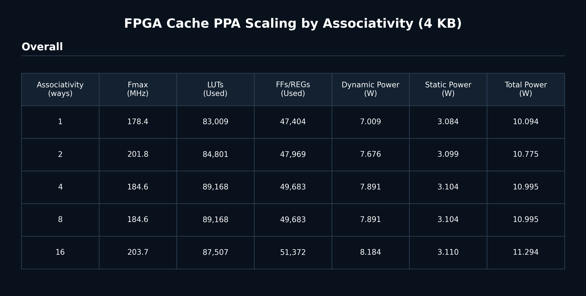

# High-Frequency Parameterized Cache Architecture

## Goal / Overview

The goal of this project will be to design, verify, optimize, and eventually physically implement a high-performance parameterized cache architecture. This project aims to study cache architecture tradeoffs while following a realistic ASIC development methodology from RTL design through physical implementation.

The cache architecture will be:

- Parameterized
- N-way set associative
- Non-blocking
- Out-of-order response capable
- High-frequency oriented
- Designed using synthesizable RTL
- Fully verified before optimization

This project will use a structured engineering flow:

1. Design the cache architecture.
2. Verify functionality using both directed and constrained-random testing.
3. Perform FPGA implementation using Xilinx UltraScale Out-of-Context synthesis and implementation to collect timing, utilization, and power data.
4. Optimize the architecture based on those PPA results.
5. Select the best-performing architecture.
6. Complete a full RTL-to-GDSII ASIC implementation flow.

FPGA implementation will be used as an architectural evaluation step before ASIC implementation. The final objective will be to understand how architectural decisions affect performance, power, and area while progressing from RTL through physical implementation.

---

## Project Roadmap

The project will be divided into four major phases.

## 1. Design Specification

In this phase, we will define the cache architecture and develop a modular RTL implementation suitable for verification, optimization, and physical implementation.

We will:

- Define the cache architecture
- Develop a parameterized RTL implementation
- Support configurable cache size
- Support configurable associativity
- Implement a non-blocking cache architecture
- Support multiple outstanding misses
- Implement an out-of-order response mechanism
- Implement critical-word-first behavior for misses
- Track 8 reusable CPU request ID slots and return the corresponding request ID with each CPU response
- Model CPU-side forward pressure on request valid and CPU-side backpressure on response ready
- Assume no downstream memory backpressure at this cache boundary
- Implement replacement policies
- Implement write-back/write-allocate behavior
- Produce a modular RTL design suitable for verification and physical implementation

The cache interface will be designed for a CPU pipeline that may apply forward pressure and backpressure independently. CPU request issue will be controlled through request valid/ready behavior, and CPU responses will be allowed to stall through response ready. The cache will preserve the CPU request ID and return it with the corresponding response so an out-of-order CPU pipeline can correctly associate returned data with the original request.

The downstream memory side will assume no memory-request backpressure at this cache boundary. This assumption will match the planned RISC-V out-of-order CPU environment, where downstream flow control and memory-system pressure will be handled by a larger cache-coherence and memory hierarchy structure rather than by this local cache interface.

---

## 2. Verification

In this phase, we will verify functional correctness before beginning architectural optimization. The verification process will aim to answer a simple question first: does the cache return the right data, with the right CPU request ID, under both normal traffic and pressure?

The verification environment will use a self-checking SystemVerilog testbench. The testbench will drive CPU requests into the cache, model downstream memory, track the expected response for every request, and compare every returned read against a golden memory model.

The environment will include:

- A synthesizable cache DUT instantiated across associativity configurations
- A downstream word-addressed RAM model with tracked memory response IDs
- A golden memory model for data correctness checking
- Scoreboards for expected CPU responses
- Reusable CPU request ID slots
- Directed and randomized request streams
- Configurable CPU request-valid and CPU response-ready probability knobs
- Per-test statistics for hits, misses, reads, writes, data checks, data errors, memory traffic, evictions, and writebacks

The CPU interface will support 8 reusable request ID slots. Each request will carry a CPU request ID, and each cache response will return the matching ID along with response data and hit/miss status. This will allow the testbench to verify correctness even when responses return out of issue order.

The normal fast regression entry point will be:

```bash
./verify.sh
```

This root-level script will run four compact PASS/FAIL checks:

- QuestaSim with CPU request/response probabilities set to `1.0 / 1.0`
- QuestaSim with CPU request/response probabilities set to `0.8 / 0.8`
- Xcelium with CPU request/response probabilities set to `1.0 / 1.0`
- Xcelium with CPU request/response probabilities set to `0.8 / 0.8`

The detailed simulator logs will remain in the simulator-specific folders, but the root workflow will keep the terminal output short so it is easy to see whether the design passed.

Xcelium support will be provided through the `xcelium/` directory. This flow will use a Cadence file list, compile the same RTL and `Test_Complete.sv` testbench, elaborate the `Test_Complete` top module, and run the simulation in batch mode without launching SimVision. Before using the Xcelium flow directly, the Cadence environment should be loaded:

```bash
source /apps/settings
cd xcelium
./run.sh
```

The direct Xcelium script will also support the same probability knobs used by the root verification flow:

```bash
./run.sh 1.0 1.0
./run.sh 0.8 0.8
```

For compact automation, the root `./verify.sh` script will call Xcelium in quiet mode and pass those values into the testbench through command-line parameter overrides. Full Xcelium output will be saved in `xcelium/logs/xrun.log`, while the terminal will only report PASS or FAIL. This gives us a second simulator backend for cross-checking the same verification environment without changing RTL or testbench behavior.

We will use a mix of:

- Directed testing
- Random testing
- Functional coverage
- Self-checking testbench infrastructure
- Scoreboards
- Corner-case testing
- Stress testing
- Regression testing

Optimization will only begin after functional correctness has been demonstrated.

### Verification Test Suite

The regression will run the full test suite for each associativity configuration. With the current verification knobs, each associativity run will issue 200,500 CPU requests, and the full five-associativity sweep will issue 1,002,500 CPU requests.

| Test | Description | CPU Requests per Associativity |
| --- | --- | ---: |
| Test1 | Sequential write/read test over word addresses to verify basic fill, hit, and readback behavior. | 20,000 |
| Test2 | Cache-overflow test using unique line addresses and a fixed word offset to stress replacement, dirty evictions, and readback correctness. | 20,000 |
| Test3 | Controlled-locality randomized burst sweep using burst lengths 8, 16, 24, 32, 40, 48, 56, 64, 72, and 80. Each phase will use a unique 500-address pool and issue 10,000 requests, for 100,000 total Test3 requests. | 100,000 |
| Test4 | Read/write/read sequence over the same address set to verify old-data reads followed by updated-data reads. | 1,500 |
| Test5 | Repeated read and write traffic to selected line addresses to stress same-address reuse and cache hit behavior. | 5,000 |
| Test6 | Repeated traffic to two words within each selected cache line to verify same-line word selection and update behavior. | 40,000 |
| Test7 | Back-to-back read/write/read triples over sequential addresses without waiting between requests. | 3,000 |
| Test8 | Back-to-back read/write/read triples over line-stride addresses to stress line replacement behavior. | 3,000 |
| Test9 | Write/read/write triples followed by final readback over sequential addresses. | 4,000 |
| Test10 | Write/read/write triples followed by final readback over line-stride addresses. | 4,000 |

---

## 3. FPGA PPA Characterization and Optimization

In this phase, we will synthesize and implement the design using Xilinx UltraScale devices in Out-of-Context mode. This will give us practical timing, utilization, and power data before we choose which cache architecture is worth carrying forward into a deeper ASIC flow.

We will collect:

- Maximum operating frequency
- Resource utilization
- Power consumption

The PPA workflow will live under `openflex/`. From that directory, a single associativity run will be launched with:

```bash
./timing.sh N
```

where `N` will be one of:

```text
1, 2, 4, 8, 16
```

If no associativity is provided, the script will default to associativity 8:

```bash
./timing.sh
```

Each run will execute the existing OpenFlex/Vivado timing flow for the selected associativity and place the results in a per-associativity PPA folder:

```text
openflex/PPA/assoc_N/
  cacheN.csv
  outputs/
  power/
```

The `cacheN.csv` file will store the timing and utilization table for that associativity. The `outputs/` directory will hold the latest Vivado output reports for that associativity, replacing the previous contents each time that associativity is rerun. The `power/` directory will preserve timestamped post-route power reports so multiple power runs can be compared over time.

This structure will make it easy to compare associativity choices without overwriting results from other configurations. For example, `assoc_4` and `assoc_8` can each keep their own timing reports, utilization reports, route reports, and power history.

Current PPA visualization:



Multiple cache configurations will be evaluated, including different associativities, cache sizes, and architectural optimizations. These measurements will guide architectural optimization and allow quantitative comparison of design tradeoffs.

FPGA implementation will serve as an intermediate architectural evaluation step, not as the final implementation target.

---

## 4. RTL-to-GDSII Flow

Once the architecture has been verified and optimized, we will transition to a complete ASIC implementation flow. This phase will demonstrate the complete digital IC implementation process from synthesizable RTL through manufacturable layout. We will go through the whole RTL -> GDSII flow with the best design implemented on the FPGA in terms of PPA tradeoffs. 

This flow will include:

- Logic synthesis
- Static Timing Analysis (STA)
- Floorplanning
- Placement
- Clock Tree Synthesis (CTS)
- Routing
- Timing closure
- Power analysis
- Physical verification
- GDSII generation

The ASIC implementation phase will connect the architectural design decisions made earlier in the project to their physical consequences in timing, power, area, and layout complexity.

---

## Project Goal

Our goal is to produce a high-performance parameterized cache architecture while studying the impact of architectural decisions on performance, power, and area throughout both FPGA and ASIC implementation flows. The project will combine architecture design, functional verification, FPGA-based PPA characterization, optimization, and full RTL-to-GDSII implementation into a complete engineering research workflow.
