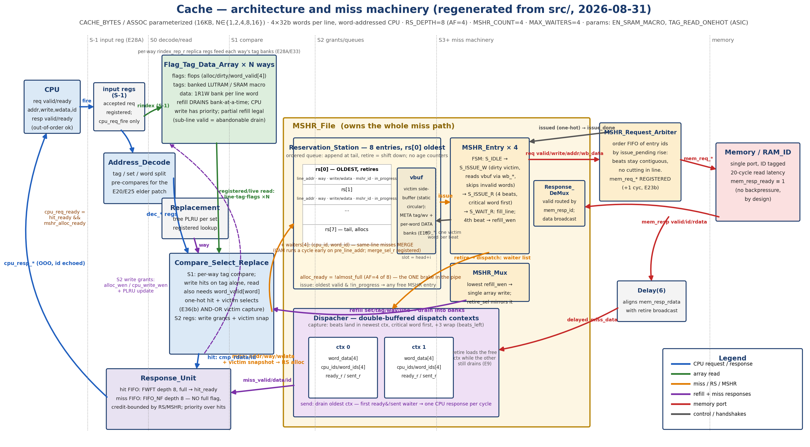
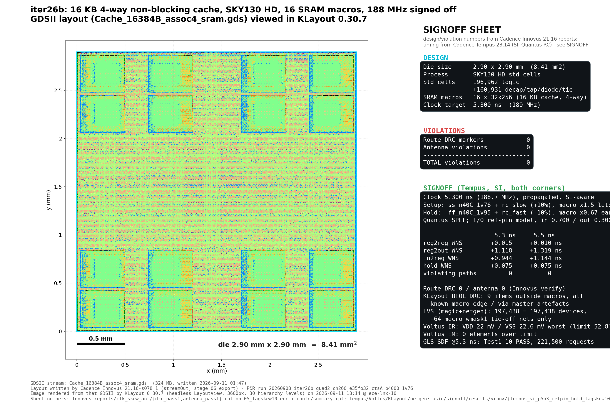
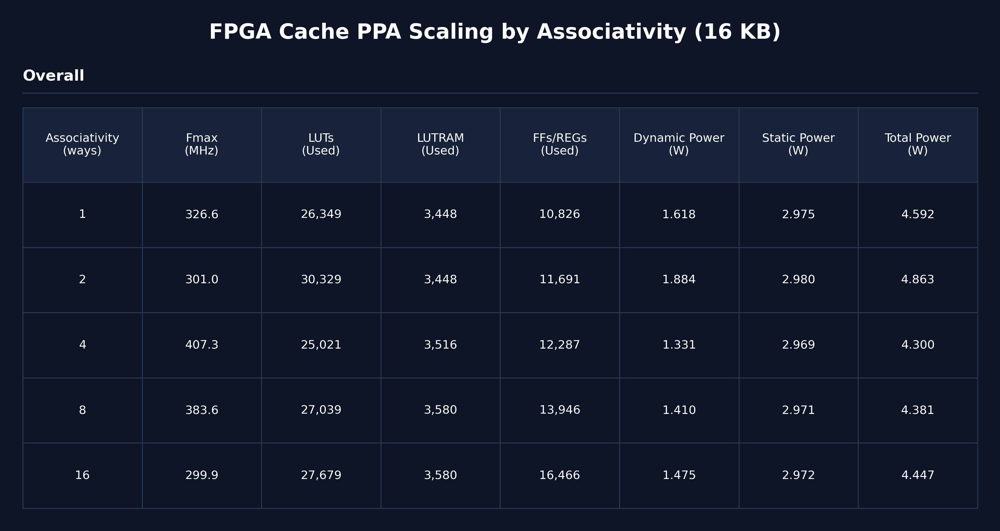
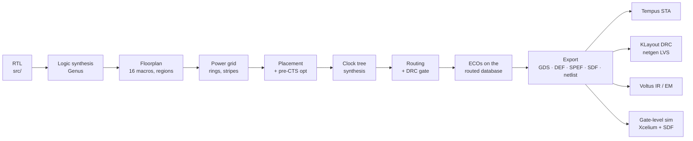
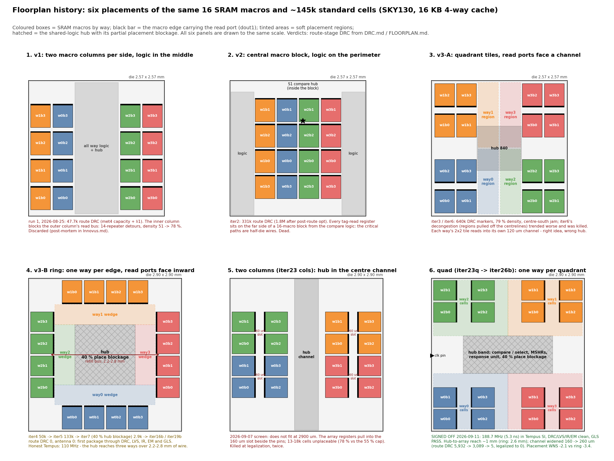
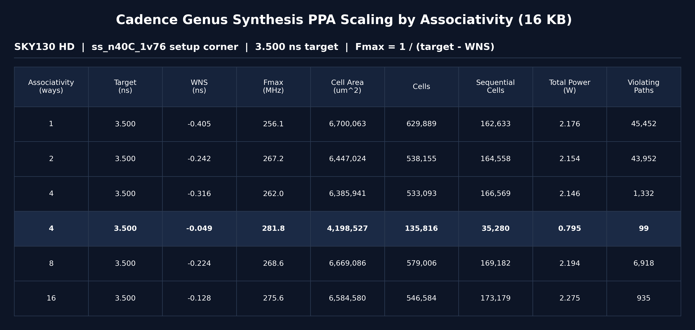

# High-Frequency Parameterized Cache Architecture

## The design at a glance



*How a request flows: the hit path runs across the top (steps 1–5), the non-blocking miss
machinery across the bottom (steps 6–11). Sub-line valid bits let a write miss complete
immediately, back-pressure exists at exactly one point, and four misses stay in flight with
same-line waiters merged and responses returning out of order.*

The same RTL, taken through the full ASIC flow (Genus synthesis, Innovus place-and-route, Tempus /
Voltus / KLayout / netgen signoff on SKY130 with 16 OpenRAM SRAM macros), rendered from the actual
GDSII stream the flow exports:



*The signed-off layout (iteration 26b, 2026-09-11): a 2.90 mm × 2.90 mm die, ~197k logic cells
plus 16 SRAM macros in four quadrant blocks with the shared miss-handling logic in the middle
band. The sheet is the signoff record: 5.3 ns / 188.7 MHz in Tempus with signal integrity and
extracted parasitics, 0 violating paths, route DRC 0, antenna 0, mask DRC clean outside the
vendor macros, LVS device-exact, IR and EM clean, and the full regression passing in gate-level
simulation at that clock. §4 explains every stage that produced it; the layout alone is
`asic/signoff/GDS11_Image/Iter26b.png`.*

---

## Goal / Overview

The goal of this project will be to design, verify, optimize, and eventually physically implement a high-performance parameterized cache architecture. This project aims to study cache architecture tradeoffs while following a realistic ASIC development methodology from RTL design through physical implementation.

The cache architecture will be:

- Parameterized
- N-way set associative
- Non-blocking
- Out-of-order response capable
- High-frequency oriented
- Designed using synthesizable RTL
- Fully verified before optimization

This project will use a structured engineering flow:

1. Design the cache architecture.
2. Verify functionality using both directed and constrained-random testing.
3. Perform FPGA implementation using Xilinx UltraScale Out-of-Context synthesis and implementation to collect timing, utilization, and power data.
4. Optimize the architecture based on those PPA results.
5. Select the best-performing architecture.
6. Complete a full RTL-to-GDSII ASIC implementation flow.

FPGA implementation will be used as an architectural evaluation step before ASIC implementation. The final objective will be to understand how architectural decisions affect performance, power, and area while progressing from RTL through physical implementation.

---

## Project Roadmap

The project will be divided into four major phases.

## 1. Design Specification

In this phase, we will define the cache architecture and develop a modular RTL implementation suitable for verification, optimization, and physical implementation.

We will:

- Define the cache architecture
- Develop a parameterized RTL implementation
- Support configurable cache size
- Support configurable associativity
- Implement a non-blocking cache architecture
- Support multiple outstanding misses
- Implement an out-of-order response mechanism
- Implement critical-word-first behavior for misses
- Track 8 reusable CPU request ID slots and return the corresponding request ID with each CPU response
- Model CPU-side forward pressure on request valid and CPU-side backpressure on response ready
- Assume no downstream memory backpressure at this cache boundary
- Implement replacement policies
- Implement write-back/write-allocate behavior
- Produce a modular RTL design suitable for verification and physical implementation

The cache interface will be designed for a CPU pipeline that may apply forward pressure and backpressure independently. CPU request issue will be controlled through request valid/ready behavior, and CPU responses will be allowed to stall through response ready. The cache will preserve the CPU request ID and return it with the corresponding response so an out-of-order CPU pipeline can correctly associate returned data with the original request.

The downstream memory side will assume no memory-request backpressure at this cache boundary. This assumption will match the planned RISC-V out-of-order CPU environment, where downstream flow control and memory-system pressure will be handled by a larger cache-coherence and memory hierarchy structure rather than by this local cache interface.

---

## 2. Verification

In this phase, we will verify functional correctness before beginning architectural optimization. The verification process will aim to answer a simple question first: does the cache return the right data, with the right CPU request ID, under both normal traffic and pressure?

The verification environment will use a self-checking SystemVerilog testbench. The testbench will drive CPU requests into the cache, model downstream memory, track the expected response for every request, and compare every returned read against a golden memory model.

The environment will include:

- A synthesizable cache DUT instantiated across associativity configurations
- A downstream word-addressed RAM model with tracked memory response IDs
- A golden memory model for data correctness checking
- Scoreboards for expected CPU responses
- Reusable CPU request ID slots
- Directed and randomized request streams
- Configurable CPU request-valid and CPU response-ready probability knobs
- Per-test statistics for hits, misses, reads, writes, data checks, data errors, memory traffic, evictions, and writebacks

The CPU interface will support 8 reusable request ID slots. Each request will carry a CPU request ID, and each cache response will return the matching ID along with response data and hit/miss status. This will allow the testbench to verify correctness even when responses return out of issue order.

The normal fast regression entry point will be:

```bash
./verify.sh
```

This root-level script will run four compact PASS/FAIL checks:

- QuestaSim with CPU request/response probabilities set to `1.0 / 1.0`
- QuestaSim with CPU request/response probabilities set to `0.8 / 0.8`
- Xcelium with CPU request/response probabilities set to `1.0 / 1.0`
- Xcelium with CPU request/response probabilities set to `0.8 / 0.8`

The detailed simulator logs will remain in the simulator-specific folders, but the root workflow will keep the terminal output short so it is easy to see whether the design passed.

Xcelium support will be provided through the `xcelium/` directory. This flow will use a Cadence file list, compile the same RTL and `Test_Complete.sv` testbench, elaborate the `Test_Complete` top module, and run the simulation in batch mode without launching SimVision. Before using the Xcelium flow directly, the Cadence environment should be loaded:

```bash
source /apps/settings
cd xcelium
./run.sh
```

The direct Xcelium script will also support the same probability knobs used by the root verification flow:

```bash
./run.sh 1.0 1.0
./run.sh 0.8 0.8
```

For compact automation, the root `./verify.sh` script will call Xcelium in quiet mode and pass those values into the testbench through command-line parameter overrides. Full Xcelium output will be saved in `xcelium/logs/xrun.log`, while the terminal will only report PASS or FAIL. This gives us a second simulator backend for cross-checking the same verification environment without changing RTL or testbench behavior.

We will use a mix of:

- Directed testing
- Random testing
- Functional coverage
- Self-checking testbench infrastructure
- Scoreboards
- Corner-case testing
- Stress testing
- Regression testing

Optimization will only begin after functional correctness has been demonstrated.

### Verification Test Suite

The regression will run the full test suite for each associativity configuration. With the current verification knobs, each associativity run will issue 200,500 CPU requests, and the full five-associativity sweep will issue 1,002,500 CPU requests.

| Test | Description | CPU Requests per Associativity |
| --- | --- | ---: |
| Test1 | Sequential write/read test over word addresses to verify basic fill, hit, and readback behavior. | 20,000 |
| Test2 | Cache-overflow test using unique line addresses and a fixed word offset to stress replacement, dirty evictions, and readback correctness. | 20,000 |
| Test3 | Controlled-locality randomized burst sweep using burst lengths 8, 16, 24, 32, 40, 48, 56, 64, 72, and 80. Each phase will use a unique 500-address pool and issue 10,000 requests, for 100,000 total Test3 requests. | 100,000 |
| Test4 | Read/write/read sequence over the same address set to verify old-data reads followed by updated-data reads. | 1,500 |
| Test5 | Repeated read and write traffic to selected line addresses to stress same-address reuse and cache hit behavior. | 5,000 |
| Test6 | Repeated traffic to two words within each selected cache line to verify same-line word selection and update behavior. | 40,000 |
| Test7 | Back-to-back read/write/read triples over sequential addresses without waiting between requests. | 3,000 |
| Test8 | Back-to-back read/write/read triples over line-stride addresses to stress line replacement behavior. | 3,000 |
| Test9 | Write/read/write triples followed by final readback over sequential addresses. | 4,000 |
| Test10 | Write/read/write triples followed by final readback over line-stride addresses. | 4,000 |

---

## 3. FPGA PPA Characterization and Optimization

In this phase, we will synthesize and implement the design using Xilinx UltraScale devices in Out-of-Context mode. This will give us practical timing, utilization, and power data before we choose which cache architecture is worth carrying forward into a deeper ASIC flow.

We will collect:

- Maximum operating frequency
- Resource utilization
- Power consumption

The PPA workflow will live under `openflex/`. From that directory, a single associativity run will be launched with:

```bash
./timing.sh N
```

where `N` will be one of:

```text
1, 2, 4, 8, 16
```

If no associativity is provided, the script will default to associativity 8:

```bash
./timing.sh
```

Each run will execute the existing OpenFlex/Vivado timing flow for the selected associativity and place the results in a per-associativity PPA folder:

```text
openflex/PPA/assoc_N/
  cacheN.csv
  outputs/
  power/
```

The `cacheN.csv` file will store the timing and utilization table for that associativity. The `outputs/` directory will hold the latest Vivado output reports for that associativity, replacing the previous contents each time that associativity is rerun. The `power/` directory will preserve timestamped post-route power reports so multiple power runs can be compared over time.

This structure will make it easy to compare associativity choices without overwriting results from other configurations. For example, `assoc_4` and `assoc_8` can each keep their own timing reports, utilization reports, route reports, and power history.

Current results (16 KB cache, XCU250-FIGD2104-2L-E, out-of-context, all five measured on the same
RTL revision, 2026-08-20):

| Associativity (ways) | Fmax (MHz) | LUTs (Used) | LUTRAM (Used) | FFs/REGs (Used) | Dynamic Power (W) | Static Power (W) | Total Power (W) |
|---:|---:|---:|---:|---:|---:|---:|---:|
| 1 | **326.6** | 26,349 | 3,448 | 10,826 | 1.618 | 2.975 | 4.592 |
| 2 | 301.0 | 30,329 | 3,448 | 11,691 | 1.884 | 2.980 | 4.863 |
| 4 | 282.3 | 26,331 | 3,514 | 12,609 | 1.514 | 2.973 | 4.486 |
| 8 | 269.8 | **26,203** | 3,578 | 13,955 | 1.477 | 2.972 | **4.449** |
| 16 | 299.9 | 27,679 | 3,580 | 16,466 | **1.475** | 2.972 | 4.449 |

Fmax is U-shaped in associativity at this capacity: direct-mapped leads outright, and sixteen-way
beats four- and eight-way because halving the per-way set depth shortens the flag-write decode that
dominates the worst paths (the one cone the data-bank SRAM macros will not absorb). Utilization is
nearly flat (26.2k-30.3k LUTs), so the choice at 16 KB is driven by frequency and power.

These numbers are regenerated with `openflex/collect_ppa.py`, which reads each `cache<N>.csv` plus
the newest post-route power report, cross-checks every Fmax against the `WNS` in that same
associativity's `post_route_timing_summary.rpt`, and warns if a row's `ASSOC` field does not match
the folder it landed in.

Current PPA visualization:



Multiple cache configurations will be evaluated, including different associativities, cache sizes, and architectural optimizations. These measurements will guide architectural optimization and allow quantitative comparison of design tradeoffs.

FPGA implementation will serve as an intermediate architectural evaluation step, not as the final implementation target.

---

## 4. RTL-to-GDSII Flow

This is the part of the project that turns the verified, FPGA-characterized RTL into a
manufacturable layout and then proves, with the same signoff tools a tapeout uses, that the
layout works at a stated frequency. The whole chain runs on the UF ECE servers with Cadence Genus,
Innovus, Quantus, Tempus and Voltus, plus KLayout and netgen for the physical checks the SkyWater
PDK only supports in open-source tools. Every stage below has a longer, hands-on document in the
repo; this section is the map.

### 4.1 The result

| | Signed-off package (P&R iteration 26b, 2026-09-11) |
|---|---|
| Design | 16 KB, 4-way, non-blocking cache, 16 × `sram_1rw1r_32_256_8` OpenRAM macros (one per way and word bank) |
| Process | SkyWater SKY130, `sky130_fd_sc_hd` standard cells, 5 routing layers |
| Die | 2.90 × 2.90 mm (8.41 mm²); 4.74 mm² of cells and macros, 59 % density |
| Cells | 196,962 logic + 160,931 physical (decap / tap / diode / tie) + 16 macros |
| Clock | **5.3 ns = 188.7 MHz**, Tempus signoff STA, signal-integrity aware, `ss_n40C_1v76` corner, extracted parasitics |
| Timing margin | reg2reg +0.015 ns, I/O paths > +0.9 ns, hold +0.075 ns, 0 violating paths (5.5 ns / 182 MHz closes on two independent exports) |
| Physical verification | Innovus route DRC 0, antenna 0; KLayout mask DRC clean outside the vendor macros; LVS device-exact (197,438 = 197,438) |
| Power integrity | Voltus static IR: 22 mV worst on both rails (budget 52.8 mV); electromigration 0 elements over limit; 817 mW at the tool's default activity |
| Gate-level simulation | Full Test1–10 regression on the post-layout netlist with SDF delays at 5.3 ns: PASS, 221,500 requests, 0 data errors |

For scale, the first honest signoff of this design (iteration 19b, the ring floorplan, 2026-09-07)
was 110 MHz. The floorplan change and four post-route ECOs described below took it to 188 MHz on
the same RTL.

### 4.2 The flow at a glance


```mermaid
flowchart LR
    RTL[RTL<br/>src/] --> SYN[Logic synthesis<br/>Genus]
    SYN --> FP[Floorplan<br/>16 macros, regions]
    FP --> PG[Power grid<br/>rings, stripes]
    PG --> PL[Placement<br/>+ pre-CTS opt]
    PL --> CTS[Clock tree<br/>synthesis]
    CTS --> RT[Routing<br/>+ DRC gate]
    RT --> ECO[ECOs on the<br/>routed database]
    ECO --> EX[Export<br/>GDS · DEF · SPEF · SDF · netlist]
    EX --> STA[Tempus STA]
    EX --> PV[KLayout DRC<br/>netgen LVS]
    EX --> PI[Voltus IR / EM]
    EX --> GLS[Gate-level sim<br/>Xcelium + SDF]
```

| Stage | Tool | What it does | Where to read more |
|---|---|---|---|
| Logic synthesis | Genus (DC as cross-check) | RTL → gate netlist on the SKY130 cell library, SRAM macros bound, first timing estimate | `asic/README.md`, `asic/MACROS.md` |
| Floorplan | Innovus stage 01 | die size, where the 16 macros go, soft regions for each way's logic and the shared "hub" | `asic/PnR/innovus/FLOORPLAN.md`, `asic/PnR/DRC.md` |
| Power grid | Innovus stage 02 | rings, stripes, straps, rail connection; validated later by Voltus | `asic/signoff/voltus/voltus.md` |
| Placement | Innovus stage 03 | cells placed and pre-CTS timing optimization | `asic/PnR/DRC.md` (the density/congestion story) |
| Clock tree | Innovus stage 04 | buffer tree so every flop sees the clock at nearly the same time | `asic/PnR/innovus/CTS.md` |
| Routing | Innovus stage 05 | wires on five metal layers, then a `verify_drc` gate before any post-route optimization | `asic/PnR/DRC.md` |
| ECOs | Innovus scripts | antenna diodes, PG via arrays, clock-skew delay cells, applied to the routed database | `asic/ECO.md`, `asic/PnR/innovus/scripts/` |
| Export | Innovus stage 06 | fill, merged GDSII, DEF, Quantus parasitics (SPEF), SDF, netlists | `asic/signoff/WALKTHROUGH_2026-09-04.md` |
| Signoff | Tempus, Voltus, KLayout, netgen, Xcelium | the independent proofs that the layout works | `asic/signoff/README.md` and the per-tool notes |

### 4.3 Stage by stage

**Logic synthesis.** Genus maps the RTL onto `sky130_fd_sc_hd` cells at the slow corner
(`ss_n40C_1v76`) with the data banks bound to the OpenRAM macros. The frozen netlist for the
signed-off package ("E35") is ~143k cells, 35k of them flops. One synthesis lesson that shaped
everything after it: the vendored macro timing library claims a 0.65 ns access time, but a SPICE
check of the macro shows its self-timed read needs most of a half clock period; we carry a ×1.5
derate on every macro arc and treat the macro read as a half-cycle path. Details and the derate
derivation: `asic/MACROS.md`. The Genus/DC associativity sweep is in §4.5.

**Floorplan.** With 16 hard macros covering a third of the core, the floorplan decides the
frequency and the routability before any other stage runs. Six placements were tried:



The lesson in that picture is a physical-design classic. Floorplans 1–3 could not be routed at
all: they either blocked the macros' read buses with other macros or piled the shared logic
into a jam the router could not clear. The ring (4) was the first routable floorplan, and the
one that first passed every physical check, but it caps the clock: the shared miss-handling logic
sits in the middle and its 128-bit refill bus has to reach three ways over 2.2–2.8 mm of wire,
which costs 2–3 ns however it is driven. The two-column layout (5) shortens that reach but does
not fit on a 2.9 mm die. The quadrant layout (6) gives each way a 2 × 2 macro block whose read
ports face an interior standard-cell channel, puts the hub in a band across the middle, and cuts
the worst hub-to-way reach to about 1 mm. Placement-stage worst slack went from -3.44 ns on the
ring to -2.1 ns on the quad with nothing else changed, and after routing and ECOs it is the
188 MHz package. Derivation of the die size and the placement numbers: `FLOORPLAN.md`.

**Power grid.** Met5 horizontal straps, met4 vertical stripes, a ring, and the standard-cell
rails. The grid was drawn in stage 02 and only *validated* at the end by Voltus, which is the wrong
order and cost two ECOs: every place a 2 µm strap crossed a 2 µm stripe had a single via cut
carrying 2–4× its electromigration limit. The fix was via pads at every crossing on all four die
edges, applied on the routed database. The earlier ring package also had a whole column of
standard-cell rows with no power connection at all, found by LVS rather than by the power tools.
Both stories, with the numbers, are in `asic/signoff/voltus/voltus.md` and `lvs/lvs.md`.

**Placement.** The way regions and the hub band are soft guides; the one hard rule that made the
design routable is a 40 % partial placement blockage over the hub, which leaves room for wires
where the shared logic converges. That one change took the route DRC count from 133,000 to
2,900 on the ring (iteration 5 → 7), and the same rule carries into the quad. The methodology
note in `asic/PnR/DRC.md` is the routing-DRC campaign: 26 iterations, each changing one variable,
with an autopsy per run.

**Clock tree synthesis.** Innovus CCOpt builds a buffered tree to ~35k sinks. On this design the
tree is balanced at 3.6 ns insertion delay with 0.35 ns skew. The expensive lesson here was in the
constraints, not the tree: for a week the flow exported a clock source latency of -7.3 ns from
the CTS step and Tempus applied it to launch clocks only, so every internal path looked 7.3 ns
better than it was. Finding and removing that is what turned the "300 MHz" of early September into
the honest 110 MHz of iteration 19b, and it is written up in `CTS.md` §5 as the thing to check
first on any flow that reports a number too good to be true.

**Routing.** NanoRoute on five metal layers (li1 excluded), followed by a hard gate: the flow
refuses to run post-route optimization unless `verify_drc` is near zero, because optimizing on
top of an unroutable placement was measured to multiply the violations. Iteration 26b came out of
the router at 7 violations and was legalized to 0 by hand-written rip-up-and-reroute scripts; the
53 antenna violations were closed to 0 with a diode-attach recipe that replaces the tool's own
antenna ECO (which wrecked the route). Antenna rules, why the router's fixer failed, and the
recipe: `DRC.md` and `scripts/antenna_attach6.tcl`.

**ECOs on the routed database.** Four engineering change orders, each verified with DRC,
antenna, placement-overlap and timing checks before it was kept:

| ECO | Script | What it fixed | Effect |
|---|---|---|---|
| Antenna diodes legalized | `antenna_attach6.tcl` | 10 diodes had been dropped on top of the flops they protect (caught by LVS and KLayout, not by DRC) | LVS clean |
| PG via arrays, west edge | `pg_westvia_eco.tcl` | 1-cut vias at strap/stripe crossings over the EM limit | VSS EM 3.95× → 1.43× |
| PG via arrays, east + north | `pg_eastnorth_eco.tcl` | the same class on the other edges | EM 0 elements over limit |
| Clock-skew delay cells | `clk_skew_eco.tcl` ×2 | 160 delay buffers on the SRAM-read capture flops, then 176 on the tag-read flops: "useful skew" applied by hand to the two paths that set the period | 170 MHz → 182 MHz → 188.7 MHz |

The clock-skew ECO is worth understanding: the macro launches its read data on the falling
clock edge, so the capture flop has half a period minus the macro's access time to work with.
Delaying only those capture flops' clock by 0.3 ns borrows time from the (slack-rich) path after
them. It is the same trick a CTS tool calls useful skew; doing it as a surgical ECO on 336 flops
kept the rest of the tree, and the hold margin, untouched.

**Export.** Stage 06 adds fill cells, streams a merged GDSII (cell and macro layouts included,
which matters: an unmerged GDS has nothing for DRC to check), writes the DEF, extracts parasitics
with Quantus using a tech file built and validated in-house, and writes the SDF and two netlists
(one for simulation, one with power pins for LVS).

**Signoff.** Five independent proofs, each with its own note under `asic/signoff/`:

- *Static timing (Tempus).* An independent timer with extracted parasitics and crosstalk analysis,
  multi-corner: setup at the slow library corner with wires scaled +10 %, hold at the fast corner
  with wires scaled -10 %. The I/O is modelled against a reference flop's clock arrival with the
  input/output delay contract the SDC promises. 5.3 ns closes with 0 violators; the table and the
  full list of caveats (macro derate, no on-chip-variation derate, the OpenRAM hold-after-edge
  unknown) are in `tempus/tempus.md`.
- *Mask DRC (KLayout).* The PDK's `sky130A_mr.drc` deck, back-end layers, on the merged GDS.
  Nine items outside the macros, all known artefacts of via masters and macro edges. The
  24k items inside the macros are the OpenRAM bitcell arrays against the periphery rules and are
  the vendor's, not ours. Magic was tried first and retired after three self-contradicting runs.
- *LVS (Magic + netgen).* Layout extracted with the macros as black boxes, compared against the
  post-route netlist with power pins: device-count exact, and the only unmatched nets are the 64
  write-mask pins the macro abstract leaves unconnected. LVS is also what found the overlapping
  diodes and the floating power rails of the earlier package.
- *Power integrity (Voltus).* Static IR drop and electromigration on the exported DEF and SPEF.
- *Gate-level simulation (Xcelium).* The same self-checking testbench from §2 run on the
  post-layout netlist with SDF back-annotation at the signoff period. It needed its own campaign
  (`xcelium/GLS.md`): reset-free arrays hold the simulator's X forever unless power-up is modelled
  explicitly, and the testbench had to learn the clock-tree insertion delay and the SDC input-delay
  contract to drive the netlist honestly.

### 4.4 What the number does and does not claim

188.7 MHz is a signoff-quality number for this package with these caveats stated in the sheet:
the macro corner is a ×1.5 derate of the PDK's typical-voltage library rather than a characterized
cold-slow corner; standard cells carry clock uncertainty but no OCV derate; the SRAM-read capture
flops sample 0.6 ns after the macro's own rising edge, and neither the library nor the simulation
model can say whether the OpenRAM output holds that long (the honest fix is an RTL pipeline stage
at the macro output, at +1 cycle of hit latency); and 15 ps of setup margin is inside
signal-integrity noise, so 182 MHz (5.5 ns), which closes on two separate exports, is the safer
figure to quote. Everything above is on the PLE-free, extracted, routed layout; nothing is an
estimate.

### 4.5 Logic synthesis PPA sweep

Logic synthesis is also run standalone across associativities so the architectural comparison
from §3 can be repeated on a real standard-cell library. Both tools target SKY130 HD; from
`asic/`:

```bash
./run_genus.sh N        # Cadence Genus
./run_dc.sh N           # Synopsys Design Compiler
./sweep.sh -j 2         # several configurations
```

Results land in `asic/PPA/<genus|dc>/assoc_N/` and are collected into `asic/PPA/RESULTS.md` by
`asic/collect_ppa.py` (`--png` renders the charts). Synthesis numbers use placement-based wire
estimates and are a floor; the post-P&R numbers in §4.1 are the ones that count.




### 4.6 Reproducing the signed-off package

```bash
source /apps/settings
cd asic && ./run_genus.sh 4                                   # E35 netlist, ASSOC=4, macros bound
cd PnR && ./run_v3.sh                                         # stages 00-05 with the iter26b knobs
#   (ASIC_FLOORPLAN=floorplans/fp_iter23_quad.tcl ASIC_FP_WAY_CHANNEL=260 ASIC_MAX_FANOUT=32 ...,
#    the exact set is recorded in the run's knobs.txt)
innovus/scripts/winner_chain.sh <run_stamp>                   # hold fix -> antenna -> export -> KLayout + LVS + Tempus
cd ../../xcelium && GLS_XINIT=1 GLS_HALF_PERIOD=2.65 GLS_IO_LATENCY=3.6 GLS_IN_DELAY=0.7 ./run_gls.sh postlayout
```

Every P&R run records its knobs in `knobs.txt`, and every signoff result is filed under the run's
stamp in `asic/signoff/results/`, so a number can always be traced to the GDS it was measured on.

---

## Project Goal

Our goal is to produce a high-performance parameterized cache architecture while studying the impact of architectural decisions on performance, power, and area throughout both FPGA and ASIC implementation flows. The project will combine architecture design, functional verification, FPGA-based PPA characterization, optimization, and full RTL-to-GDSII implementation into a complete engineering research workflow.
