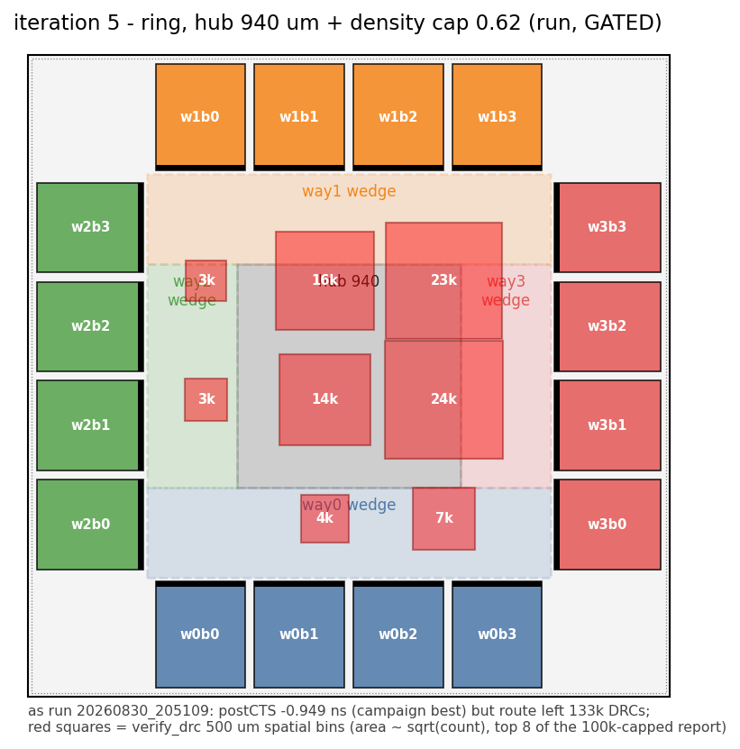
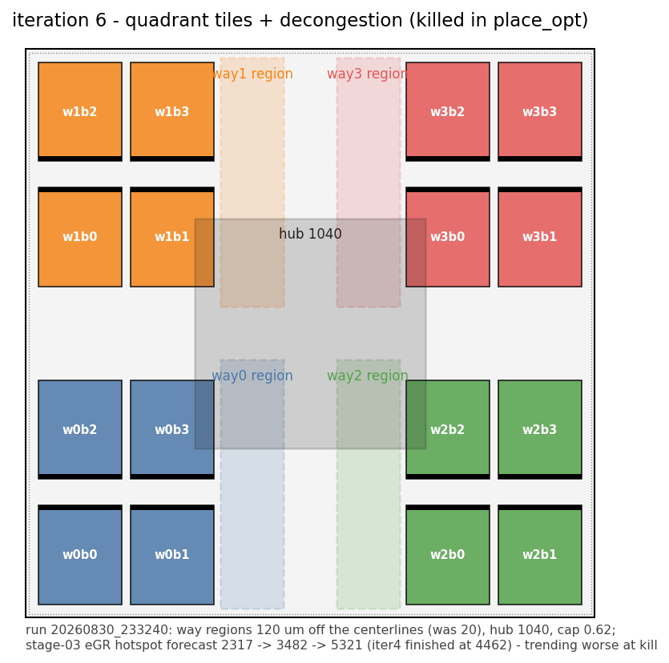

# The routing-DRC campaign — iteration ledger, autopsies, hypotheses

Every P&R iteration since v2 has died at the same place: the router finishes,
`verify_drc` counts tens of thousands of violations, and the stage-05 gate
(`ASIC_DRC_GATE=2000`) stops the flow. This file is the ledger: what each
iteration was, what it violated, why we believe it happened, and what the next
generation changes. Floorplan geometry and the v3 design rationale live in
`FLOORPLAN.md`; this file owns the DRC story.

A healthy detail route ends with **hundreds** of violations that the router's
own iterations clean up. 50k–640k means the placement was unroutable and the
router is reporting that fact — *the router doesn't create congestion, it
reveals it*. Post-route optimisation on such a route makes it strictly worse
(measured twice, below).

## The autopsy recipe

Same four cuts on every `reports/route/drc.rpt`, so iterations are comparable:

```bash
R=reports/route/drc.rpt
grep -aoE "^[A-Z-]+:" $R | sort | uniq -c | sort -rn                  # by type
grep -aoE "\( (li1|met[1-5]) \)" $R | sort | uniq -c | sort -rn       # by layer
grep -a "Bounds" $R | awk -F'[(,) ]+' \
  '{print int($3/500)*500"_"int($4/500)*500}' | sort | uniq -c | sort -rn  # 500um bins
grep -ac "FE_" $R; grep -ac "CTS_" $R                                 # net class
```

(`$3/$4`, not `$2/$3` — the `Bounds :` colon is its own field.)

**Forecast table for every run** (stage-03 settled / post-CTS / route-phase
hotspot + overflow): `python3 innovus/scripts/forecast_table.py` — run it any
time; it reads the logs live, future iterations included.

## The scoreboard — one iteration sequence, variable explicit

Every row is an iteration of the SAME experiment: get the 16KB ASSOC=4 cache
through route with < 2000 DRCs at 4.0 ns. Early iterations varied the
floorplan; from iteration 7a on, the variable is whatever the evidence
indicted — floorplan, CTS, netlist, or route settings. One variable per
iteration; "vs" names the baseline it changed.

All at 4.000 ns SDC; iters 3+ at corner ss_n40C_1v76 + vendor macro ×1.5.
"markers" = live `top.markers` at the gate; `drc.rpt` caps at 100k.

| iter | aka | variable changed (vs baseline) | postCTS WNS | route DRC | verdict |
|---|---|---|---|---|---|
| 1 | v1 | floorplan: two macro columns per side | — | 47.7k (met4 cap + li1 poison) | discarded; post-mortem in `Innovus.md` |
| 2 | v2 | floorplan: central macro block, perimeter logic | -2.685 | **331k**; postroute opt → 1.8M | dead. Cross-corner (ss_100C_1v60 ×2.0) — don't compare timing |
| 3 | v3-A | floorplan: quadrant tiles | -1.326, hold clean | **640,478 markers** | gate FAIL; 79% density, center-south jam |
| 4 | v3-B | floorplan: true ring, hub 840 | -1.252, hold clean | **50,524** (104,845 markers) | gate FAIL — best of the pure-floorplan era |
| 5 | ringhub | floorplan: hub 940 (+25%) + global density cap 0.62 (vs 4) | **-0.949, hold clean** | **~133k live** | gate FAIL — hub bins 2× iter4: hub size & global cap measured dead |
| 6 | quadfix | floorplan: quad regions -120 µm, hub 1040, cap 0.62 (vs 3) | killed in place | — | forecast worsening (hotspot 2317→5321) |
| 7a | G7a (side) | CTS: clock met3–met5 + 2w2s NDR (vs 5, same placement) | -1.081 | **402,306 markers** | FAIL — NDR doubled clock footprint on starved layers |
| **7** | **G7b** | **floorplan: iter5 + 40% partial place blockage over hub (vs 5)** | -1.272, hold clean | **2,859 / 7,034 markers** | **breakthrough — 47×; hub bins clean, residue at 3 region corners** |
| 7r | G8-repair | route: 2 extra detailRoute passes on iter7's route | n/a | 3,103 (plateau) | residue is HARD (placement pile-ups), not congestion |
| 8 | G7d | netlist: E36(b) RTL, -2,336 cells (vs 7, same floorplan) | -1.512, hold clean | **2,133,467 markers at the gate** | CATASTROPHIC gate FAIL (14:02) — the netlist is toxic to this floorplan: EstWL +32%, eGR overflow 20%H vs 6.4%, hotspot saturated die-wide |
| 9 | fp_iter8 | floorplan: iter7 + 25% corner dampers; e35 netlist (vs 7) | -1.068, hold clean — best ring timing | **48,250 / 99,479 markers — 17× WORSE than iter7** | gate FAIL 18:23 — dampers BACKFIRED: violations moved back into the hub ring (bins (1500,1000) 8k, (500,1000) 7.8k). Total blocked area too large; displaced cells re-piled around the hub |
| 10 | — | netlist: E36(b') single-tree (vs 9, same floorplan) | launched 08-31 ~16:00 | — | pre-launched to save time: the destination of most decision branches. Kill criterion: stage-03 forecast reads iter8-class (>10%H / hotspot >5k) |

Schematics for every iteration: `floorplans/draw_floorplans.py` → `fp_*.png`.

## Path to the default flow

The goal is that the winning recipe stops being env-override archaeology and
becomes what `run_v3.sh` (or a successor `run.sh`) does with no arguments.
Promotion checklist, in order, each gated on the previous:

1. **Iteration 8 passes (or nearly passes) the gate** → its floorplan+netlist
   pair is the recipe.
2. **Adopt E36(b) in `src/`** as the new RTL baseline: re-apply the diff
   (snapshot `20260831_e36b.tar.gz`, or replay the edit), run the full
   4-check regression, commit as the new frozen point (e35abcde+e36b).
3. **Point the flow defaults at the recipe**: `innovus/env.sh` pins the
   corner-2 E36(b) netlist (`20260831_015237`); `run_v3.sh` defaults
   `ASIC_FLOORPLAN` to the winning fp file; retire the `_PRESET_*`
   workaround once env.sh no longer clobbers.
4. **Fold the blockage into the floorplan file permanently** (it already
   lives in `fp_iter7.tcl`) and delete dead knobs (`ASIC_PLACE_MAX_DENSITY`
   did nothing — remove or document as no-op).
5. **Re-run stages 00–06 end to end from the defaults alone** (no env
   overrides) and require: gate pass, export completes, signoff STA at
   200 MHz. That run's numbers become the quoted result.



Innovus captures: `floorplans/iter*.gif` (gallery table in `FLOORPLAN.md`).

## Autopsies

### Iteration 4 (run `20260830_160055_v3b`)

- Type: ~35k SHORT + 15k SPACING. Layer: met2 > met1 > met3.
- Spatial: hub square. Net class: ~90% of report lines involve `FE_*`
  (opt-inserted) nets, 19% `CTS_*`.
- Global eGR overflow only 7.3% H → **local** over-density, not global
  shortage. ~13k region-spill cells stacked into the 840 µm hub.

### Iteration 5 (run `20260830_205109_iter5_ringhub`)

- Type: 65,499 SHORT + 33,896 SPACING + 562 MAR (+ 36 minor).
- Layer: met2 37.8k > met3 30.1k > met1 18.4k > met4 12.7k > met5 0.9k.
  **li1: 3 violations** — pin access is *not* a problem (hypothesis 5 closed).
- Net class (report lines): `FE_*` 90.8k, functional (`GEN_WAYS`/MSHR/…) 14.1k,
  `CTS_*` 12.9k.
- Post-route `timeDesign`: setup -3.964 / TNS -298 — routing detours ate 3 ns
  of the -0.949 placement. (Timing over shorted extraction is fiction anyway.)
- **Smoking gun**: the first pages of `drc.rpt` are one long **met1** wire of
  net `CTS_789` at y≈2280.5 shorting a picket-fence of `FE_*`/functional nets
  at ~1.4 µm intervals — a clock spine routed on met1 straight through the
  congested zone.

### Iteration 4 vs 5 — the hub bins (hypothesis 6 answered)

Violations per 500 µm bin (bin SW corner), same recipe both runs:

| bin | iter4 | iter5 |
|---|---|---|
| (1000,1000) | 11,107 | 13,933 |
| (1000,1500) | 7,700 | 16,454 |
| (1500,1000) | 6,945 | **24,042** |
| (1500,1500) | 5,784 | **22,965** |

Same hub bins, **~2× the intensity** — despite +25% hub area and the density
cap. Growing the hub let placement/CTS/opt pull *more* cells and wire into it.
Hub geometry and placement density are now both measured dead as levers.

## Controlled experiments

| experiment | result | lesson |
|---|---|---|
| `optDesign -postRoute` on iter4's gated route (`reports/postroute_exp/`) | DRC 50,524 → 136,482 (×2.7); v2 measured ×5.5 | post-route opt cannot fix routing DRCs and multiplies them; the 2000 gate is justified |
| Router-only repair, 28 `routeDesign` iterations on iter4's `05_route.enc` (scratch session 619cf9cc, `rr/route_repair.log`) | 50.5k → 48k → 36k → 31k → **plateau oscillating ~23–26k** from iteration ~20; +8.9k antenna | iteration halves the count and stalls: half the violations are detours, half are wires that cannot all exist. Demand > supply is not iterable-away |
| Density cap 0.62 in iter5 | `setPlaceMode -place_global_max_density 0.62` accepted; opt log shows nets "could not be fixed because of exceeding max local density" (cap enforced); hotspot forecast still worsened 4.5k → 7.9k | hypothesis 3 closed: the cap was honored and it is not the binding variable |

## Hypothesis scoreboard

| # | hypothesis | status | evidence / decisive test |
|---|---|---|---|
| 1 | **Layer supply**: met5 carries the PDN stripes, li1 excluded → ~4.5 signal layers over the hub; supply, not demand, is short | **MEASURED as the symptom** (G7-diag: 26% of hub tracks remaining vs ~56% outside, ~24k gcells completely full; per-layer split still unmeasured) | met5 has only 0.9k viols (signals barely use it). Test: per-layer congestion + track utilization over hub bins on iter5's `05_route_raw.enc` (G7-diag) |
| 2 | **Absolute convergence**: 4 ways × 128b victim/rdata buses + hit FIFO + CTS all meet in the hub | **LIVE — wire through-demand, not pins** (G7-diag: pin density clean, no bin > 0.5). | Test: pin-density map over hub (G7-diag); real fix is E36(b) per-way compare split (RTL) |
| 3 | density cap not honored | **REOPENED — accepted but ineffective**: density_map shows 36.5% of core bins placed at 0.95–1.00; `-place_global_max_density` bounds the global target only, regions/guides/opt blow past it locally. Hard fix = partial placement blockage (G7b) | see experiments table |
| 4 | **CTS spine through the hub** on low metal | **SUPPORTED**: met1 `CTS_789` picket-fence; 13% of report lines touch `CTS_*` | Fix: clock `route_type` met3–met5 + NDR before `ccopt_design` (G7a) |
| 5 | li1 exclusion breaks pin access | **CLOSED — no**: 3 li1 violations in 100k | — |
| 6 | did the hub bins move iter4→5? | **CLOSED — same bins, ~2× intensity** | table above |

## Generation 7 — attack plan

Ordered by cost; each answers a hypothesis before the next lap is bought.
postCTS timing is a solved problem (-0.949, hold clean) — **route DRC < 2000
is the only gate that matters now.**

1. **G7-diag** (~20 min, batch Innovus on iter5 `05_route_raw.enc`): per-layer
   congestion, hotspot map, density/pin-density over the hub bins. Decides
   between hypotheses 1 and 2 with numbers.
2. **G7a — clock layers** (~3–4 h, restarts from iter5 `03_place.enc`, the
   campaign-best placement, via `ASIC_PNR_FROM=04`): `create_route_type` clock
   met3–met5 + NDR, `set_ccopt_property route_type` before `ccopt_design`,
   then CTS → route. Tests hypothesis 4; keeps everything else frozen.
3. **G7b — PDN relief over the hub** (if G7-diag confirms hypothesis 1):
   stage-02 stripe pitch/width change over the hub region, then 03→05.
4. **G7c — E36(b) per-way compare split** (if hypothesis 2 survives G7-diag):
   RTL change (per-way AND-OR reduce, small central mux) → regression (both
   pressures, all four checks) → Genus → P&R. The structural fix for
   convergence; the only lever that shrinks what *must* meet in the hub.

Deadline context: signoff 2026-09-13; def-of-done can be "clean 200 MHz STA
signoff + DRC/LVS documented". iter5's placement is the asset to protect —
generations reuse its `03_place.enc` wherever the change allows it.

## G7-diag results (2026-08-31 01:38, iter5 `05_route_raw.enc`, `reports/diag/`)

All nine candidate reports worked (`diag_congestion.tcl`). The verdict:

- **Hub track supply exhausted**: inside the 940 µm hub square, only **26% of
  routing tracks remain free vs ~56% outside**, with ~24k gcells at zero
  remaining in each direction (`congest_area.txt`, 500 µm-hub awk). Hotspot #1
  bbox (1265,1439)–(1787,1961) = the NE hub quadrant — exactly the worst DRC
  bins.
- **Pin density is clean** — no bin above 0.5 (global 0.1285). The congestion
  is wire *through*-demand, not pin access.
- **The real culprit the cap missed**: `density_map` shows **36.5% of core
  bins placed at 0.95–1.00 cell density** (51% above 0.75), while the way
  *regions* average a healthy 0.577. The stacked bins are the hub/spill area:
  `-place_global_max_density 0.62` shapes the global placer target and did
  nothing locally. Hypothesis 3 reopened and answered properly: density IS a
  lever, but the knob is a **partial placement blockage**, not the mode switch.
- Global route usage 47.5/49.6% — abundant supply overall. Purely local.

**Plan revision**: G7b = re-place with `floorplans/fp_iter7.tcl` (fp_iter5 +
40% partial placement blockage over the hub, launched 2026-08-31 ~01:55,
stamp `20260831_g7b_hubblock`); PDN-pitch relief demoted to G7c pending a
per-layer split; E36(b) becomes G7d. G7a (clock met3–met5 + 2w2s NDR, from
iter5's placement) running in parallel — stamp `20260831_g7a_clklayers`.
`run_v3.sh` now honors a pre-set `ASIC_FLOORPLAN`.

### Iteration 7a autopsy (G7a, run `20260831_g7a_clklayers`, gate FAIL 402,306 markers)

100k-capped rpt: 74,129 SHORT + 25,741 SPACING; met2 45.2k > met3 24.7k >
met1 24.1k > met4 5.9k; same hub bins as iter4/5 at higher intensity (peak
32.3k at (1500,1000) vs iter5's 24.0k); `CTS_*` lines 9.2k (was 12.9k),
`FE_*` 92.6k. Clock NDR verified applied: 350 clock nets under `cts_2w2s`.
Lesson: on a supply-starved region, any demand-adding "fix" is a dose
increase. Remaining levers all REDUCE hub demand or raise hub supply:
G7b (density blockage, running), G7c (PDN pitch), G7d (E36(b) netlist,
verified + synthesizing).

### Iteration 7 autopsy (G7b, run `20260831_g7b_hubblock`, gate FAIL at 7,034 markers — the breakthrough)

2,606 SHORT + 247 SPACING (+ ~1,083 antenna in the marker count); layer met2
1.2k > met4 1.0k > met1 0.4k. **The violation geography left the hub**: top
bins are (500,2000) 955 and (0,2000) 772 — the NW edge, likely blockage-
displaced cells crowding the way1/way2 corner — while the old hub bins hold
only 82–183 each. Hold clean, postCTS -1.272 (the ~320 ps vs iter5 is the
blockage pushing hub logic apart — the congestion/timing trade, now measured).
Hypothesis 3 (density, in its reopened form) is CONFIRMED as the dominant
cause: a hard local density cap alone took the route from 133k to 2.9k.
Hypothesis 2 (convergence) is thereby bounded: real but manageable once local
density is controlled.

**Generation 8**: (a) G8-repair — router-only iterations on G7b's saved
`05_route.enc`: 2.9k is inside the regime where iteration converges (unlike
iter4's 50k plateau); target < 2000, ideally hundreds. (b) G7d/G8b — full run,
fp_iter7 + the E36(b) netlist (`20260831_015237`, victim cone deleted at the
source), aiming to cut the residue and win back timing simultaneously.

### Iteration 7r: router-only repair on iteration 7 — PLATEAU (hard residue)

Two more `detailRoute` passes with antenna diode fixing: markers 4,351 → 4,322
(final verify_drc 3,103 DRC viols + antenna = 7,425 markers). The residue is
UNCHANGED in place and kind: ~2.7k SHORTs, met2/met4, same three bins
((500,2000), (0,2000), (1000,500)), overwhelmingly `FE_OFN*` fanout-buffer
nets shorting **each other**. Verdict: not congestion the router can iterate
away but locally unroutable pockets — opt-inserted buffer clusters that the
40% hub blockage displaced into the way-region corners. Repaired DB saved
(`05_route_repaired.enc`).

Two candidate fixes, one already in flight:
- **G7d (running)**: same floorplan, E36(b) netlist — deletes part of the
  very populations that are shorting; may clear the corners on its own.
- **fp_iter8 (if G7d's residue persists)**: shape the blockage — e.g. grade
  it (40% core / 20% rim), or add small partial blockages at the three
  residue corners so displaced cells spread instead of piling.

### Iteration 8 autopsy (G7d, e36b netlist) — a *placement* catastrophe, not congestion creep

Route finished with ~2,029,826 live violations (rpt capped 100k: 82k SHORT,
met2 58.7k > met1 19.7k > met3 17.4k). NOT the hub, NOT iter7's corners: the
mass sits in the SOUTH band (bins (1500,500) 39k, (1000,500) 24k, (2000,500)
19k) — way0's wedge and the way0/way3 quadrant. Functional nets involved are
way0/way3 FTDA internals (word_valid_mem, rline_raw, tag banks); 88% of lines
are `FE_OFN*` opt buffers. Confirmed NOT the clock hook (no `cts_2w2s` in the
log; iter7 also had ccopt's own clock NDRs). Same floorplan, same flow, only
the netlist changed — and demand exploded: EstWL 23.8M µm vs 18.0M (+32%),
eGR overflow 19–20%H vs 6.4%, hotspot 24,469 vs 1,042 at route start.

Working theory: E36(b)'s victim capture builds TWO parallel AND-OR reduction
trees (vfree/vrepl) per field where the old form was one indexed mux. The
512b of per-way line/tag buses now feed two physically separate reduction
networks; placement pulled them apart and the buses effectively cross the
die twice, then postCTS opt (TNS -542 vs -221) buried the region in fanout
buffers. Synthesis (PLE) saw none of this: Genus scored e36b BETTER (-49.7
vs -59.3 WNS, area flat). **Lesson: netlist-level wiring *demand* is a PPA
axis PLE timing does not price; a logic win can be a routability loss.**

Options for the netlist axis (not launched): E36(b') = single AND-OR tree on
miss_way_onehot (one 2:1 deeper on the late path, but the same bus demand as
the original mux — keeps the encode/decode deletion without doubling wires).

### Iteration 9 (launched): corner damping on the proven recipe

fp_iter8.tcl = fp_iter7 + three 25% partial placement blockages over
iteration 7's measured residue bins (NW band and south pocket). Netlist:
e35abcde reference (the proven router). Goal: spread the FE_OFN corner piles
→ push 2,859 under the 2,000 gate.

### Iteration 9 autopsy — the dampers backfired

48,250 DRC (32k SHORT + 16k SPACING) / 99,479 markers. The geography INVERTED:
iter7's corner piles are gone, but the violations went back to the hub ring —
the top bins are the hub periphery. Mechanism: hub 40% + two 25% dampers
removed too much aggregate capacity near the center; the cells that must be
central re-piled in the remaining ring between blockages at higher density
than iter7 ever had. Placement forecast (1,150, campaign best) did not see it
— same lesson as iter4: tile-level forecasts miss local-density pile-ups.
postCTS -1.068 = best ring timing (the dampers helped timing while killing
routability). Lesson: blockage is not additive; total reserved area near the
center is bounded.

### Iteration 11 (launched 18:48): E36(b') on PLAIN fp_iter7

The screen's settled reading — **331 hotspot / 5.8% H, campaign best, on the
unmodified iter7 floorplan** — makes (e36bp × fp_iter7) the strongest
untested cell of the matrix. Iteration 11 CONTINUES the screen's run from its
saved 03_place.enc (ASIC_PNR_FROM=04, same stamp) — no re-place, CTS + route
only, gate ~21:30. Iteration 10 (e36bp × damped fp_iter8) continues in
parallel: its lighter netlist may survive the dampers where e35 did not; its
gate is the (damper × light-netlist) data point either way.

## Methodology: the placement sweep (2026-08-31 evening)

**Why.** Iterations 7 and 9 steered congestion with hand-carved
`createPlaceBlockage` geometry. Reading `03_place.tcl` afterwards showed the
flow set only `place_global_place_io_pins` and `legalization_inst_gap 1` -
**Innovus's own congestion machinery was at defaults for all eleven
iterations**, and `setOptMode` had no congestion awareness at all, so
post-CTS optimisation buffered freely into congested regions (the mechanism
behind iterations 8 and 9). The professional escalation order is the reverse
of what we did: effort knobs and cell padding first, manual geometry last,
RTL and area after that. The sweep opens that untouched axis.

**Design.** One design point held fixed - E36(b') netlist x plain `fp_iter7` -
so the only difference between arms is the knob set. Control is already
measured: the iteration-11 placement (settled post-place **7,174 / 12.6% H**).
`cong_effort=high` is held across all arms, so arm B vs control isolates it;
padding and opt-congestion then vary as a 2x2 factorial:

| arm | place_global_cong_effort | legalization_inst_gap (padding) | extra |
|---|---|---|---|
| control (iter 11) | default | 1 | — |
| B | high | 1 | — |
| C | high | **2** | — |
| D | high | **4** | — (padding dose-response) |
| E | high | **2** | max_density 0.55 |

**Arms D/E were redefined 30 min in — and this is the sweep's first result.**
They originally carried `setOptMode` congestion effort; **Innovus 21.16 rejects
BOTH spellings** (`-congEffort` and `-congestionEffort`), so the arms had
silently degenerated into duplicates of B and C. The catch-wrapper caught it
and `reports/place/cong_knobs.txt` reported it, which is exactly why the hooks
were written that way - an unguarded `setOptMode` would have crashed four
2-hour placements instead. **Finding: there is no opt-stage congestion knob in
this build; post-CTS optimisation cannot be made congestion-aware by a mode
setting.** That closes one of the two axes the sweep set out to test, and it
means the iterations 8/9 buffer-flood mechanism can only be attacked through
placement (padding/effort) or through the netlist, not through opt settings.
Always read `cong_knobs.txt` before trusting an arm.

Stages 00-03 only (~2 h/arm), four arms in parallel: `./sweep_place.sh`
(subset: `./sweep_place.sh B D`). Compare with
`python3 innovus/scripts/forecast_table.py`.

**Implementation.** `03_place.tcl` gained `ASIC_PLACE_CONG_EFFORT`,
`ASIC_PLACE_INST_GAP` and `ASIC_OPT_CONG_EFFORT` hooks. They are **default
off** - with no env set the stage emits nothing new, so iterations 1-11 stay
comparable. Each setting is catch-wrapped (option spellings vary across
Innovus builds; an unknown option must not cost a 2-hour placement) and what
actually applied is written to `reports/place/cong_knobs.txt`.

**Decision rule.** Best settled post-place hotspot/overflow wins; ties broken
by preCTS WNS. The best one or two arms continue 04-05 (CTS + route) on the
same stamp via `ASIC_PNR_FROM=04`, exactly as iteration 11 continued the
screen - no re-placement. If no arm beats the control materially, the axis is
closed and the campaign falls back to the iteration-7 recipe plus targeted
ECO on its 2,859.

**Caveat carried from iterations 4 and 9.** A good forecast is necessary, not
sufficient: both routed far worse than their forecasts implied because their
killer was sub-tile local density. Any arm that wins here must ALSO be checked
with `reportDensityMap` (bins at 0.95-1.00) before it is trusted.

## Overnight 2026-08-31 -> 09-01: four tracks

| track | run | tests | why it matters |
|---|---|---|---|
| **12** | `20260831_iter12_e35_fp7_conghigh` | e35 x fp_iter7 x `cong_effort=high` | **the direct gate shot**: one variable added to the campaign's best route (iter 7, 2,859). If the tool's own congestion effort closes an 859-violation gap, the campaign is over |
| sweep + continue | `sweep{B,C,D,E}` then `cont*` | E36(b') x fp_iter7 x knob arms; best 2 auto-continue to CTS+route (`sweep_continue.sh`) | whether the placer can give E36(b') an iteration-7-quality placement - that would pair the campaign's best TIMING (-0.714) with its best routability |
| 11 | `20260831_e36bpscreen` | E36(b') x fp_iter7, default knobs | already past CTS at **-0.714 setup / hold clean - first run under the 200 MHz bar**; its route number calibrates the netlist against iteration 7 |
| export | `export_iter7.tcl` in the iter-7 run dir | stage 06 on iteration 7's gated route | **first GDS of the v3 flow.** Not clean (carries 2,859 violations) - it proves the back end and gives Magic DRC / netgen LVS a real target, so the 9/13 deliverable does not depend on winning the congestion fight first |

Morning triage order: iteration 12's gate, then the continued arms', then
iteration 11's, then whether the GDS exists. Any gate under 2,000 promotes to
"Path to the default flow"; otherwise the best-DRC run plus targeted ECO, with
the exported GDS carrying the deliverable.

## Iteration 11 verdict: the E36(b') netlist is better, and still not good enough

61,670 DRC / 127,446 markers on plain `fp_iter7` - the floorplan where the
e35 netlist routed to **2,859**. Same geometry, same knobs, only the netlist
differs, so the attribution is exact:

| netlist on fp_iter7 | postCTS WNS | route DRC |
|---|---|---|
| e35abcde (iteration 7) | -1.272 | **2,859** |
| E36(b') single tree (iteration 11) | **-0.714** | 61,670 |
| E36(b) dual tree (iteration 8) | -1.512 | 2,133,467 |

The single-tree repair was worth **34x** against E36(b) - but it is still
**21x worse than the netlist it replaced**. So the conclusion is not "the dual
tree was the bug"; it is that **restructuring the victim select into AND-OR
reduction at all costs routability on this floorplan**, and the dual tree
merely made it catastrophic. The indexed mux that E36 set out to delete was
apparently doing something useful physically: it kept the 512-bit per-way
line/tag buses terminating at ONE place instead of fanning into a reduction
network spread across the hub.

The forecast called it again (post-CTS 3,210 -> "tens of thousands"), which
strengthens the calibration table: at this sample point the only outliers
remain iterations 4 and 9, both sub-tile density failures.

**Consequence for the campaign.** E36(b') keeps its timing crown (-0.714,
the only run under the 200 MHz bar) but cannot be promoted on routability.
The two axes have now traded places: the best-timing netlist routes worst,
and the best-routing netlist (e35) has 270 ps less margin. Whether that gap
matters depends on post-route optimisation, which no run has reached yet.

**Overnight priority therefore shifted to the e35 netlist**: iteration 12
(e35 x fp_iter7 x `cong_effort=high`) and iteration 13 (same + `inst_gap=2`,
queued behind the sweep arms) test the new congestion knobs on the netlist
that actually routes. The four E36(b') sweep arms still run - they answer
"can placement effort rescue a wire-hungry netlist?", which is worth knowing
either way - but they are no longer the lead horse.

## Sweep result (arms B and C settled, 2026-08-31 22:42) — the knob BACKFIRED

Settled post-place readings, all on the same design point (E36(b') x
`fp_iter7`), control = iteration 11's placement:

| arm | knobs | settled place hotspot / ovf H |
|---|---|---|
| control (iter 11) | default | **7,174 / 12.6 %** |
| B | `cong_effort=high` | **13,271 / 15.0 %** |
| C | `cong_effort=high` + `inst_gap=2` | **16,924 / 15.5 %** |
| D | `cong_effort=high` + `inst_gap=4` | 12,015 / 14.0 % |
| **E** | `cong_effort=high` + `inst_gap=2` + **`max_density 0.55`** | **2,251 / 7.9 %** |

**`place_global_cong_effort high` made congestion ~1.9x WORSE than the
default**, and adding cell padding made it worse again. That is the opposite
of the intent, and it is a real answer to the question the sweep was built to
ask: the tool's congestion machinery is not an unused lever waiting to help -
on this design it actively hurts. (Plausible mechanism: high congestion effort
trades wirelength for spreading, and on a design whose problem is *local*
convergence around a blocked hub, spreading lengthens the very buses that are
saturating - the same trap iteration 5 fell into by enlarging the hub.)

**Do not read D and E from the table until they exit** - those runs are still
placing and their table row shows the latest mid-placement reading, which is
exactly the dip-versus-settled trap recorded above. Only rows whose run has
exited are settled values.

**Consequence for the runs in flight.** Iterations 12 and 13 both carry
`cong_effort=high` on the e35 netlist (13 also adds padding). If the effect
transfers across netlists, both are compromised - iteration 7 with DEFAULT
knobs settled at 3,156 and routed to 2,859. The decision data is iteration
12's own settled post-place number, due when it reaches `ccopt_design`:

- settles **above ~3,156** -> the knob hurts here too; kill iteration 13
  (which stacks the padding arm C showed is worse still) and treat the
  congestion-knob axis as closed-negative;
- settles **below 3,156** -> the effect did not transfer, and iteration 12 is
  a real shot at the gate.

## Sweep verdict (all four arms settled, 2026-08-31 23:00): the density cap wins

Arm **E beat everything, including iteration 7's e35 placement**:

| run | settled place hotspot / ovf H |
|---|---|
| **E: cong=high + gap 2 + max_density 0.55** | **2,251 / 7.9 %** |
| 7: e35, DEFAULT knobs | 3,156 / 8.5 % |
| 11 control: e36bp, default knobs | 7,174 / 12.6 % |
| D: cong=high + gap 4 | 12,015 / 14.0 % |
| B: cong=high | 13,271 / 15.0 % |
| C: cong=high + gap 2 | 16,924 / 15.5 % |

**The differentiator is `max_density`, not congestion effort.** C and E are
identical except for the density cap, and it moved the number 16,924 -> 2,251,
a **7.5x** improvement. Congestion effort ALONE (B) and with padding (C, D)
made things 1.7-2.4x worse than the default.

**Hypothesis 3, third revision.** Iteration 5 measured `max_density 0.62`
alone as honored-but-useless. It is not useless - it needed either the tighter
value (0.55), the congestion objective active alongside it, or both. The
global density knob and `cong_effort` are only useful *together*; each alone
is neutral-to-harmful. This is the first knob combination in the campaign that
beats hand-carved blockage geometry at its own game (arm E still sits on
`fp_iter7`, so it is blockage AND density cap, not either alone).

**Queue consequences, applied 2026-08-31 23:03:**
- arm E continued through CTS + route (`contE`) - its gate is the test of
  whether a 2,251 placement finally routes clean;
- **iteration 13 cancelled before it started** - it was arm C's losing recipe
  (cong+padding, no density cap) on the e35 netlist;
- **iteration 14 queued** (`20260901_iter14_e35_fp7_armE`): arm E's exact knob
  set on the **e35 netlist** - the campaign's best-routing netlist with its
  best-placing knobs, on the proven floorplan. It starts when iteration 12
  frees a slot;
- **iteration 12 settled at 8,664 / 11.4 %** against iteration 7's 3,156 / 8.5 %
  (same netlist, same floorplan, only `cong_effort=high` added): the knob makes
  the e35 netlist **2.7x worse**, so the effect transfers across netlists and
  the congestion-effort axis is **closed negative on both**. Stopped 23:34 to
  free its slot for iteration 14.
- **arm E's continuation reached post-CTS at 279 hotspot / 4.6 % H** - against
  iteration 7's 1,042 / 6.5 %, which routed to 2,859. That is 3.7x better than
  any pre-route reading in the campaign and, on the calibration curve, points
  at a route in the low hundreds.

## CAVEAT on the two overnight exports (2026-08-31 23:45)

Both iteration 7 and iteration 11 exported a full artifact set, but **through
different extraction engines**, so their Tempus numbers are NOT directly
comparable:

| | iteration 7 | iteration 11 |
|---|---|---|
| gds / def / sdf / v | 368M / 349M / 118M / 42M | 371M / 350M / 115M / 42M |
| **spef** | **262 MB, Quantus** (`ASIC_QRC_TECH` set, both corners updated in-session) | **793 MB, LEF-based** (`ASIC_QRC_TECH` never set by `export11.sh`) |

The 3x SPEF-size gap has two candidate causes that are not separated yet:
iteration 11's route is far more congested (61,670 violations = enormous
detour/jog count = more RC segments), and the engines differ. Do not read the
size difference as evidence for either until they are extracted the same way.

**To fix before quoting any iteration-7-vs-11 signoff comparison:** re-run
iteration 11's export with `ASIC_QRC_TECH` set, exactly as iteration 7's was:

```bash
ASIC_QRC_TECH=$REPO/asic/signoff/quantus/techfiles/sky130A_nom.tch \
  asic/PnR/export_route.sh 20260831_e36bpscreen_ss1v76_d1p5 <e36bp netlist>
```

Tonight's Tempus run on iteration 11 still has standalone value (it is a real
signoff STA of the best-timing design) - it just cannot be differenced against
iteration 7's.

## 2026-09-01: the gate was counting stacked markers - iter14 actually PASSES

**Morning gate readings vs reality.** The stage-05 gate counts
`dbGet top.markers`, on the assumption that verify_drc's markers are the only
ones on the design. That held for iteration 7 (gate 2,859 = verify_drc 2,859)
and iteration 11 (61,670 = 61,668), because those were single-pass runs. It
does NOT hold for runs that came through `sweep_continue.sh` (restored
03_place.enc, re-ran CTS+route): stale markers from the earlier pass plus
NanoRoute's own antenna/check markers stack under verify_drc's. Corrected,
like-for-like (verify_drc geometry count):

| run | gate read (top.markers) | verify_drc | antenna |
|---|---|---|---|
| iter7 (e35 x hub-blockage) | 2,859 | 2,859 | 1,106 |
| iter11 (e36b' x fp_iter7) | 61,670 | 61,668 | 3,395 |
| contE (e36b' x fp7 x armE) | 8,437 | **3,377** | - |
| iter14 (e35 x fp7 x armE) | 2,375 | **706** | 860 |

Consequences:
- **ITER14 IS UNDER THE GATE: 706 <= 2,000.** First run of the campaign to
  pass on the metric the gate was designed around. 4x better than iter7
  (2,859), the previous best. Breakdown: 684 SHORT / 20 SPACING / 1 MINWIDTH /
  1 NSMETAL. Post-route (pre-opt) timing: setup WNS -2.372 all / **-0.516
  reg2reg** (implied reg2reg Fmax ~249 MHz), hold -2.174 (not yet fixed - opt
  had not run).
- **contE's "forecast miss" shrinks**: 279 post-CTS hotspot -> 3,377 routed
  (not 8,437). Still a miss vs the low-hundreds prediction, and e36b' still
  routes worse than e35 on identical knobs (3,377 vs 706) - the netlist
  conclusion stands.
- **Gate fixed** in 05_route.tcl: `clearDrc` now runs immediately before
  verify_drc, so top.markers at the gate is verify_drc's count alone.

**Iteration 14 finished properly.** Its gated route was exported in the
morning (Quantus SPEF - 253 MB, same engine as iter7's, so those two ARE
Tempus-differenceable; artifact set gds 354M / def 338M / sdf 115M / v 41M).
After the gate misfire was found, post-route opt (setup+hold) + re-export was
launched in-place: `runs/20260901_iter14_e35_fp7_armE/opt_and_export.tcl`
(tmux `iter14_opt`), reports land in `reports/postroute_opt/`, checkpoint
`05_route_opt.enc`, outputs/ overwritten with the optimised artifact set.

**Overnight housekeeping.** The Tempus signoff chain never ran: sta.tcl
referenced `runs/<stamp>/scripts/innovus_config.tcl` (does not exist -
scripts live in `innovus/scripts/`), died at 23:38, sat until TERM'd ~11:58.
Fix the path and rerun on iter7 (Quantus SPEF already on disk) and iter14
post-opt. export11's SPEF remains LEF-based (828 MB) - re-export with
ASIC_QRC_TECH before quoting any 11-vs-7/14 signoff comparison.

**Presentation renders.** `asic/signoff/GDS11_Image/render_gds.py` renders
any run's exported GDSII through KLayout 0.30.7 (pip module, headless) into a
mm-ruled frame with a pre-signoff sheet (die size, std-cell/macro counts,
corners+derates, verify_drc breakdown, antenna, setup/hold, provenance
footer). Images for iters 7, 11, 14 are in that folder; future ones go there
too.

## First corrected Tempus signoff: iter7, propagated clocks (2026-09-01 ~15:00)

sta.tcl fixed (propagated clocks + post-CTS uncertainties 0.100/0.050, mirroring
04_cts.tcl; stage 06 now also exports as-implemented per-view SDCs). Tempus on
iteration 7's gated, UNOPTIMIZED route, Quantus SPEF, ss_n40C_1v76 / ff_n40C_1v95:

| group | setup WNS/TNS/#vio | hold WNS/TNS/#vio |
|---|---|---|
| REG2REG | **-4.291 / -7,043 / 16,936** | **-0.209 / -2.4 / 56** |
| IN2REG | clean | -3.116 / -1,993 / 1,206 |
| REG2OUT | -7.781 / -731 / 107 | clean |

- REG2REG is the meaningful pair: setup -4.291 on a route that never had
  post-route opt (repeater chains with 1.2-1.8 ns inv_2 stages on detoured
  nets - Quantus RC the LEF estimate missed), hold only -0.209 (opt-fixable).
- The PORT groups are now latency artifacts, not measurements: clock insertion
  delay is 7.433 ns (!), and the I/O budgets reference the ideal edge, so
  in2reg setup gets the whole tree depth as free time (clean) while reg2out
  setup and in2reg hold get charged it (-7.8 / -3.1). Before quoting port
  timing, the I/O reference needs a latency-matched virtual clock
  (set_clock_latency ~= insertion delay on the I/O clock) - standard OOC
  practice. Filed as a constraints TODO; does not affect reg2reg.
- 7.433 ns insertion delay is itself a finding worth revisiting at CTS
  (ccopt target, tree depth through 350k cells at ss/1.76V).
- Ideal-clock first run (superseded, for the record): reg2reg -5.658, "hold
  clean +0.127" - the +0.127 was structurally optimistic, real answer -0.209.

## PRIORITY DECISION 2026-09-01 (user call): DRC-clean over Fmax

Zero violations beats hitting 250 MHz - a clean GDS at ~210 MHz is a finished
chip; a fast dirty one is not. Consequences:
- iter14 full opt (running) is now the OPTIMISTIC arm: keep it only if its
  final DRC pattern ECOs to zero (it had closed reg2reg setup to +0.004 at
  4.0 ns mid-run, at a cost of ~8k transient route violations).
- FALLBACK ARM (matches the priority directly): restore 05_route.enc (706
  viols, reg2reg -0.516 = ~221 MHz on the Quantus-corrected timer),
  hold-only optDesign, ecoRoute -target to zero, export. Fmax = whatever
  Tempus reports on the clean database; no target-chasing.
- Hold fixing is non-negotiable either way (hold fails are functional at any
  frequency); setup shortfall is a reporting matter, not a defect.

## Iteration 15 launched (2026-09-01 ~23:15): fp_iter15 = fp_iter7 + cluster damping

Rationale closed tonight: arms B and C independently plateaued at 627/~624
from the clean 706 route (hold-only + eco-target, two different hold libs) -
the clusters are INHERENT to fp_iter7's geometry, not opt-induced. Arm A's
setup opt made it 5x worse (3,375 post-setup, hold phase oscillating ~6.1k).
Surgery (density relief on the routed DB) is still running; iter15 applies
the same relief PRE-placement instead, per the fp_iter8 precedent:
`fp_iter15.tcl` = fp_iter7 verbatim + 50% partial blockages over the four
measured cluster boxes (ring-corner convergence zones + two macro seams).

Run: `20260901_iter15_e35_fp15_damp`, tmux `iter15`. Arm E's exact knobs
(cong_effort=high, inst_gap=2, max_density=0.55, e35 netlist, no CTS NDR -
verified no logged session ever enabled the G7a hook), stages 00->05 with
**ASIC_DRC_GATE=0** so the flow routes and STOPS - no opt of any kind. Judge:
raw-route verify_drc vs fp_iter7's 706. Below ~700 and clustered less =>
hold-only continuation (armC recipe); zero-ish => straight to antenna ECO +
export + signoff triplet. Setup opt stays banned on respins.

Decision tree tomorrow AM: surgery clean -> surgery wins, iter15 becomes the
backup. Surgery dirty + iter15 < 706 -> iter16 tunes geometry (FP8.md menu:
die bump for the NE corner vs per-row GAP). Both dirty and >= 706 -> the
damping thesis is wrong, regenerate the pattern plot and rethink from data.

## Surgery FAILED (2026-09-02 ~06:00): >=100,000 violations (report cap), export withheld

Arm B act 2 is dead, and instructively so. The 46k-instance refinePlace
scramble (mean move 185 um) dirtied so much routing that ecoRoute became a
near-full re-route under the new density screens - and it could not close:
final verify_drc capped at 100,000, dominated by met1 metal shorts and
via3/via4 cut shorts clustered around GEN_WAYS[3] tag-bank nets (the same
right-row/NE-corner zone as always, now 100x worse). Post-route density
relief is now CLOSED as an approach: evicting placed cells after routing
destroys more connectivity than the freed tracks recover.

Standing scoreboard for fp_iter7: best databases are armC's 571
(hold-only, reg2reg setup +0.699, saved at iter14c 05_route_opt.enc) and the
original 706 route. KLayout (2026-09-02, signoff/drc/drc.md) proved these
counts are ~all SHORTS, not spacing - geometry outside macros is ~9 items.
ALL fp7 hopes now ride on **iter15** (pre-placement damping, placing now).
If iter15's raw route does not beat 706 decisively, escalate to iter16 =
geometry relief (FP8.md): the NE-corner convergence zone needs actual space.

Evidence preservation: armE outputs/ (the noon filled GDS that klayout_drc/
and lvs results reference) copied to outputs_noon_20260901_prefillGDS_signoff_ref/
before Arm A's export can overwrite it. Arm A itself oscillates ~7k in its
hold phase - recommend killing tmux iter14_opt to free a core-heavy slot;
its completion has zero win probability.

## Arm A closed (2026-09-02 10:24): 4,811 viols, setup +0.004 - dominated by Arm C on both axes

Full post-route opt finished: verify_drc 4,811, reg2reg setup barely positive
(+0.004). Arm C (hold-only, same starting route): 571 viols, +0.699 setup.
The optimized database is 8x dirtier AND 0.7 ns slower - setup opt's cell
insertion forced repair reroutes that repeatedly destroyed its own gains.
Setup-opt-on-fp7 is closed with prejudice. NOTE: Arm A's stage 06 export
OVERWROTE armE outputs/ with the dirty GDS; the noon signoff-reference GDS
survives in outputs_noon_20260901_prefillGDS_signoff_ref/. fp7 scoreboard
final: armC 571 / +0.699 is the lineage's best; everything now rides on
iter15 (placing) then iter16 (FP8.md) if needed.

## iter15 post-place: damping BACKFIRED globally; iter16 (die 2780) launched (2026-09-02 ~13:00)

iter15 post-place overflow: **219,755 = 16.40% H + 7.42% V** vs armE's
103,721 = 7.18%/4.13% at the same stage - the four 50% screens (on top of the
hub blockage and the 0.55 global cap) robbed enough capacity to DOUBLE
congestion. On the campaign calibration curve (7.18%H->706, 12.6%H->8,664)
that forecasts a catastrophic route. iter15 continues through CTS/route
anyway for the residual map + curve confirmation (gate=0 stops it pre-opt).

iter16 launched per FP8.md's geometry rung: `fp_iter16.tcl` = fp_iter7 with
the die as a knob (`ASIC_FP_DIE`, default/used **2780** vs 2700; rows,
wedges, hub group and hub blockage all recompute) and deliberately NO
damping boxes. Run `20260902_iter16_e35_fp16_die2780`, tmux `iter16`, armE
knobs, gate=0, stages 00->05. First run to self-record knobs.txt.
Hypothesis: the ~600 corner shorts need SPACE at the ring-corner
convergence zones, not density pressure anywhere.

Tempus port-timing methodology CLOSED same hour (signoff README): round 5b
clean - correlated-external vclk (late=early=11.901, measured ff-early 4.318
recorded), reg2out hold deferred; IN2REG setup honest (-4.028), REG2OUT
setup passes at the 0.3 budget, no phantom holds. Five validation rounds,
four script bugs + one modeling artifact fixed on iter7's corpse.

## Morning 2026-09-03: iter16 well under the beat, iter15 dead, armC signoff run

Overnight state (night_watch armed 19:49, BEAT=706, no gate fired yet):

- **iter16 (die 2780)**: post-GR overflow 1.97% H / 1.68% V (armE 7.18/4.13).
  Detail route in-flight counts by iteration: 620, 606, 539, 504, 460, 448,
  417, 288, 246 ... still falling at iteration ~15. armE FINISHED at 706, so
  iter16 is already ~65% better before post-route opt/ecoRoute. Die growth
  thesis confirmed: space at the ring corners, not density pressure.
- **iter16b (die 2900)**: post-GR 0.72% H / 0.34% V - lowest of the campaign;
  detail route started ~10:15, no count yet.
- **iter15 (damping)**: 12455, 11570, 11667, 11092, 11334, 11237 across
  iterations 15-21 - flat. DEAD, as the 16.4% H post-place overflow forecast.
  Left to time out on its own.
- Cost of the die: post-CTS reg2reg WNS iter16 -2.339 / iter16b -2.176 vs
  armE -1.255 at the same stage (longer wires). Per the 09-01 priority call
  (DRC-clean over Fmax) the chain does hold-only opt, so expect that to
  carry through. Post-CTS overflow: iter16 5.31%H (same as armE), iter16b
  3.75%H.

armC fallback package (export14c, 09-02 20:32): export OK, KLayout BEOL
238,746 items (= armE's 238,391 macro-internal baseline). Tempus had died at
sta.tcl's `create_clock vclk_io` with TCLCMD-1048: the as-implemented-SDC
branch never called `set_interactive_constraint_modes` (iter7 ran the
fallback branch, which does). Fixed in sta.tcl, rerun 10:26 (tmux
tempus14c, results/.../armC/tempus, log tempus_armC2):

| group | WNS | TNS | #vio |
|---|---|---|---|
| IN2REG | -5.840 | -2400 | 1205 |
| REG2REG | -1.468 | -1.468 | 1 |
| REG2OUT | 0.000 | 0 | 0 |
| IN2OUT | 0.000 | 0 | 0 |
| hold (all) | +5.145 | 0 | 0 |

vclk_io latency auto-measured **4.834** (iter7 was 11.901 - armC's tree is
7 ns shallower, the hub/density work paid off there). IN2REG: 965 of the
1000 census paths start at `rst` (reset buffer tree into the flop D pins via
sync-reset logic), the rest are `cpu_req_addr`/`cpu_req_id`/`mem_resp_rdata`
at ~-1.9. Same boundary item as iter7, not a P&R item. The single REG2REG
violator disagrees with Innovus's +0.699 on the same DB - sta.tcl now writes
per-group reg2reg/reg2out/in2out.rpt (rerun tempus14c_grp) to identify it.
lvs_bb on armC launched after Tempus in the same tmux; armE lvs14bb netgen
still running (~24 h, comp.out 314 MB).

### 09-03 ~11:00: the REG2REG violator is hold-fix padding - and so is IN2REG

`report_timing -path_group reg2reg` returns "no constrained paths" in Tempus
(the summary's reg2reg/in2reg are categories, not path groups); sta.tcl now
selects by `-from/-to [all_registers]` etc. The single REG2REG violator:

    RESPONSE_UNIT_HIT_FIFO_rd_ptr_r_reg[0]/Q_N -> ... -> cpu_req_ready
      -> and3b (n_126728) -> clkbuf_1, clkdlybuf4s50, 4x dlygate4sd3_1
      -> inreg_valid_r_reg/D          slack -1.468, 5.7 ns of it delay cells

The delay cells are FE_PHC hold-fix insertions on `inreg_valid_r_reg/D`,
the AND of the `cpu_req_valid` INPUT and the `cpu_req_ready` reg2reg net.
Innovus's +0.699 was pre-hold-fix; the chain's `optDesign -postRoute -hold`
added 2.2 ns to this path. Same story on the IN2REG side: the worst `rst`
path carries 9 delay cells = 7.285 ns; the exported netlist has **715
FE_PHC cells** (391 dlygate4sd3, 102 clkdlybuf).

Root cause: golden.sdc references I/O delays to the ideal `clk` edge at the
port. With the clock propagated (7.7 ns tree) every input-fed flop looks
like a ~7 ns hold violation to Innovus, which pads it. Tempus's
latency-matched vclk model - the one we decided is the truth for I/O -
shows those paths at +5.1 hold margin, so the padding is (a) unnecessary,
(b) the entire IN2REG setup wall (-5.84 = 0.7 + 4.83 + padding vs a 11.5
required), (c) the REG2REG violator. This is not an rst/boundary item after
all; it is the P&R hold fix running under a different I/O model than
signoff.

Fix (applies to the iter16/16b chain BEFORE its gate fires): the vclk block
is factored out of sta.tcl into `scripts/io_vclk.tcl` and winner_chain.sh's
chain.tcl sources it right after setAnalysisMode, before the hold opt, so
P&R and signoff use the identical I/O model. chain.tcl also writes
reports/chain/hold_before_fix.rpt and reg2reg_after_hold.rpt. Validation on
armC's own base (armE 05_route.enc -> io_vclk -> hold opt, saved as
05_armC_holdvclk.enc, NO export): tmux holdvclk14c, reports/holdvclk/.
Expect: FE_PHC count well under 715, reg2reg unchanged from +0.699, in2reg
setup no longer buried. If it validates, armC's fallback package should be
re-cut from that DB (chain passes + export + trio) rather than shipped with
the padding.

**Validation result (holdvclk14c, 12:00)** - armE 05_route.enc -> io_vclk ->
`optDesign -postRoute -hold`, no export:

| | raw SDC (shipped armC) | vclk first |
|---|---|---|
| hold cells added | 638 + 22 re-fix (715 FE_PHC total) | **49** (104 total) |
| reg2reg setup after hold fix | +0.699 -> **-1.468 at Tempus** | +0.423 -> **+0.402** |
| in2reg setup, vclk view | -5.840 / 1205 eps | **+1.504** |
| hold WNS after | +5.145 (over-padded) | +0.001 |
| verify_drc after hold opt | - | 618 |

The 49 cells fixed a real reg2reg hold violation (-0.296, out_tag_reg ->
tag_banks). Conclusion: the in2reg "wall" and the reg2reg violator were
both artifacts of hold-fixing under an I/O model that disagrees with
signoff. io_vclk.tcl is now in the chain (before the hold opt) and in
sta.tcl. Checkpoint 05_armC_holdvclk.enc is the padding-free armC base if
the fallback has to be re-cut.

Two bugs found on the way, both fixed:
- io_vclk.tcl's latency parser scanned every numeric token, including the
  "3" in the report header's "Generated on: Thu Sep 3" - it won whenever
  the tree was shallower than the day of the month (Innovus armC: 2.961 ->
  "3"; Tempus got 4.834 only because 4.834 > 3). Now parses data rows only.
- **night_watch never could fire**: pnr_note is a Tcl puts, which reaches
  the tmux pane but NOT flow.log, and night_watch grepped flow.log. iter16
  gated at 123 with no reaction. night_watch now reads the tmux pane
  (session iter$tag) first; restarted 12:01 on iter16 + iter16b, and it
  launched chain_16 immediately.

Latency note for later: Innovus reports armC's tree at 2.961 (05_route.enc,
its own RC) while Tempus reports 4.834 on the exported netlist + Quantus
SPEF + macro derates. That 1.9 ns gap between the P&R and signoff timers
is its own item once the chains are through.

Route results, die knob (fp_iter16, no damping): **iter16 (2780) detail
route ended 69, 123 after the antenna pass -> chain_16 running. iter16b
(2900) detail route ended 8** (16 in the antenna pass), stage-05 gate
pending. Against 571 (armC) / 706 (armE) on the fp7 die: the corner needed
space, not pressure. iter16b is the 9/13 candidate; iter16 the backup.

## 09-03 afternoon: both chains halt; iter16b's 35 are six DFT probe cells

Both winner chains finished ~13:00 without exporting. io_vclk.tcl did its
job inside the chain: 3 hold cells added per run (not 715), reg2reg setup
stayed positive. The plateau ECO made zero progress on either run because
ecoRoute cannot move cells, and the residual was a placement defect:

| | iter16 (die 2780) | iter16b (die 2900) |
|---|---|---|
| stage-05 gate | 123 | 38 |
| reg2reg after vclk hold fix | +0.252 | +0.920 |
| eco pass 1 / 2 | 46 / 46 | 35 / 35 |
| chain residual | 45 (40 short, 4 MetSpc, 1 NSMet) | 35 (32 short, 2 MetSpc, 1 NSMet) |
| of which probe-cell rail shorts | 4 | **24** |

**Root cause (iter16b).** 24 of the 35 markers are "Special Wire of Net
VDD/VSS & Blockage of Cell FE_USKC*_CTS_*" on met1: six instances of
`sky130_fd_sc_hd__probec_p_8`, a DFT current-probe cell whose met1 OBS
overlaps the rails. Genus and DC exclude `*probe_*`/`*probec_*` (the
mapped netlist has zero), but `PNR_DONT_USE_PATTERNS` in innovus_config.tcl
only listed `lpflow_*`, so CCOpt's useful-skew step saw probec_p_8 in its
"usable buffers" list and used it as a delay element. The markers were
already in the stage-05 gate (24 of 38); checkPlace does not flag them
because the cell is legally on its row - the LEF geometry is the problem.
The four bufbuf_16 IMPSP-2020 "cannot legalize" warnings from the chain's
hold opt were stale: all four are placed and clean now.

**Fix (interactive session tmux legal16b, scripts/legalize_init.tcl +
legalize_fix.tcl on 05_route_opt.enc):** setDontUse on the probe family,
ecoChangeCell each of the six to buf_8, ecoRoute the 12 touched nets:

| | before | after swap |
|---|---|---|
| verify_drc | 35 | **9** |
| hold WNS | +0.001 | +0.006 |
| reg2reg setup | +0.920 | +0.914 |

Checkpoint `05_legal_swap.enc`. Durable fixes: `sky130_fd_sc_hd__probe_*`
and `probec_*` added to `PNR_DONT_USE_PATTERNS` (parity with synthesis);
winner_chain.sh takes `ASIC_CHAIN_SRC` (start checkpoint) and runs
`checkPlace` at the top as a report-only gate. The region/fence section of
that report is always ~14.5k: way0-3/hub are soft instance groups from
the floorplan, not fences.

Residual 9 after the swap: 4 met4 short/spacing against GEN_WAYS[0]
bank2/bank3 SRAM pins (y 470-474, the bottom macro row's pin edge), 3 met1
wire-wire shorts in the SW (x 222-423, y 720-929), 1 met2 short into the
W3B3 macro OBS, 1 NSMet on VSS met4 at (922, 2860). Next: rip-up/reroute of
exactly those 11 nets (legalize_reroute.tcl), then the chain from the
legal checkpoint.

### 09-03 evening: the last markers are macro-threading artifacts

Rip-up/reroute of the 11 residual nets (legalize_reroute.tcl) gave 10, and
every marker moved instead of clearing. A census of signal wires inside the
16 SRAM bodies (`reports/legalize/probe3.txt`) explains it:

| macro | met1 segs | met2 segs | met4 | nets on met1-3 inside |
|---|---|---|---|---|
| way0 bank3 (bottom row) | 2361 | 2468 | 0 | 356 |
| way3 bank3 (right column) | 8966 | 8437 | 20 | 702 |
| way2 bank0 (left column) | 7104 | 7890 | 53 | 653 |
| all 16 | 2.3k-9k each | 2.3k-8.4k each | 0-53 | 278-720 each |

`sram_1rw1r_32_256_8_sky130.lef` has OBS on met1-met3 only, as 254k /
184k / 8k shape-level rectangles with routable gaps between them, no met4
OBS at all (met4 is 452 full-height 0.38-wide vdd/gnd straps exported as
PINs), and the floorplan creates no routing blockages. NanoRoute therefore
threads signals through the macro interiors on met1/met2 and lands vias
between the met4 straps. That is how it escaped the 145-pin port-0 edge of
each bottom/left-row macro, which fp_iter16 turns toward the die edge with a
24 um strip (EDGE 40 - core margin 16) to get out through. The residual
markers are the few spots where a threaded wire touches an OBS rect or a
strap by 0.1-0.4 um.

Surgery that worked (all in tmux legal16b, checkpoints 05_legal_fix*.enc):
guidance routing blockages over the affected macro bodies (met1-4,
`-exceptpgnet`), rip up ONLY the offending nets, `routeDesign` with
`-routeSelectedNetOnly`, then `deleteRouteBlk -all` so the thousands of
other threading wires are not flagged against the blockages.

| step | verify_drc | hold | reg2reg |
|---|---|---|---|
| after probe-cell swap | 9 | +0.006 | +0.914 |
| reroute 11 nets, no guidance | 10 | | |
| fix2: small blockages at the hotspots | 10 | +0.006 | +0.914 |
| fix3: whole-macro guidance, 7 nets | **7** | +0.006 | +0.914 |

The 10 -> 7 step is the first time a marker went away rather than moved.
Remaining after fix3: 3 at the bank-3 top edge (met5 track shared with a
through-net + a met3 nick), 1 in the left-edge strip beside way2 bank0, 2
met4 collisions in the strip beside W3B3, 1 NSMet on VSS. fix4 reroutes
each knot as a group (offender + partners) and adds a 1.6 um met4 VSS patch
over the overhanging via.

**Floorplan lesson for iter17.** The clean fix is blanket routing blockages
over the macro bodies in the floorplan - but that removes the interiors the
router is using to escape the port-0 edges, so it only works if those edges
face inward (flip the ring macros so the 145-pin edge points at the core)
or the EDGE margin grows from 40 to ~120 um. Either is a full 24 h P&R
(place 14 h, CTS 6.5 h, route 2.3 h on iter16b), i.e. a 09-05 result if
started 09-04. Not needed for the 9/13 package if iter16b closes.

fix4 (7 -> **14**): rerouting each knot as a group (offender + partner nets)
cleared the left-strip and W3B3 offenders but the long partners
(FE_OCPN775860_n, FE_OFN341307_n, FE_OFN262365_n_268829) landed in new
knots; the 1.6 um met4 VSS patch added a spacing marker and did not cure
the NSMet. fix5 (from fix3, offenders only, one guidance set each: 7 ->
**9**): left strip cleared; W3B3 net moved 2 um past the spot blockage;
FE_OFN321786_n_244585, denied bank3's interior on all five layers,
threaded bank2 instead and took 5 nicks in the bank2/bank3 channel. That
net (buf_6 at (2023,502) -> nand4 at (1874.7,384.4) inside the 40 um
channel) has no legal path with every other net frozen: the channel is the
escape route for both macros' edge pins. Clearing it needs a collective
re-plan of the channel (area rip-up of all signal wires in
{1846 380 1888 510} + routeDesign on the cut set), which is tomorrow's
first move. Timing never moved through fix2-fix5: hold +0.006, reg2reg
+0.914. Checkpoints 05_legal_fix3.enc (7, best) ... 05_legal_fix5.enc (9).
Session tmux legal16b stays open with fix5 loaded.

fix6 (from fix3, 7 -> **10**): collective re-plan of the bank2/bank3
channel {1846.5 380 1888 510} + the strip above bank3 {1846.5 486.5 2035 545}
(4,164 + 10,002 segments, 1,037 nets ripped up and rerouted together, met4
guarded over both macro bodies), plus the fix5 recipes. It CLEARED the
stubborn FE_OFN321786_n_244585 and the left-strip net - the first time that
net went away - but the 1,037-net re-plan seeded 6 new nicks in the strip
above bank3 (y 555-596), the W3B3 net collided again 8 um further left, and
FE_OCPN775860_n re-took its met5 track. reg2reg +0.914 -> +0.748, hold
+0.006. Checkpoint 05_legal_fix7.enc pending: full incremental routeDesign
from fix3 (NanoRoute free to rip up any net, 40 detail iterations, met4
guarded over all 16 macro bodies during the route only) - running
unattended in tmux legal16b from ~20:55.

**fix7 (from fix3): verify_drc 7 -> 1.** Full incremental `routeDesign`
(40 detail iterations, timing+SI driven, NanoRoute free to rip up any net)
with met4 guidance blockages over all 16 macro bodies during the route
only (removed before verify). Every signal marker cleared - the bank3 knot,
W3B3, the strip nicks, all of it. The one survivor is the NSMet on VSS at
(922, 2860): a M3M4 power via at the bottom end of a 22 um met4 stub whose
enclosure hangs past the stub end, i.e. a PDN artifact from 02_power, not
routing. fix8 replaces that via with `editPowerVia` (delete in the box,
re-add inside the stub/strap overlap) and re-verifies. Lesson for the
ledger: targeted reroutes with everything else frozen cannot close a
capacity-limited strip; the full router with rip-up can. Should have been
the first move after the probe-cell swap, not the seventh.

**fix8-fix10: verify_drc 1 -> 0.** There was no via under the NSMet marker
(the earlier probe had misread it): the marker was the bare bottom end of
the VSS met4 stripe stub {920.1 2859.97 922.1 2882.46}, a PDN-generation
artifact. `editDelete -area` will not remove a FIXED special wire (fix9 added
a second stub on top instead); fix10 deleted the old one by object
(`dbDeleteObj`), leaving the redrawn stub {920.1 2861.0 922.1 2883.0} with
its vias regenerated by `editPowerVia`. **iter16b: verify_drc = 0 at
05_legal_fix10.enc, hold +0.005, reg2reg +0.916 (fix7 timing; fix8-10 only
touched PG).** Antenna not yet re-measured - the chain does that.

Pre-export item found on the way: `verifyConnectivity -type special -net VSS`
lists 1000+ unconnected `VNB` terminals, all on `FE_PHC*` hold-fix cells
and a few resized `g*` cells - instances created AFTER 02_power.tcl's
`globalNetConnect ... -inst *` ran, so they never received the VPB/VNB
(and VPWR/VGND) logical assignment. The power-stage connectivity report had
0 VNB problems, so this is purely the post-power-stage instances. Fix:
re-run the globalNetConnect block at export (06_export.tcl), which would
otherwise ship an LVS open on every hold cell's well tie.

## Corner provenance audit (2026-09-03 ~20:40): iter16/16b and every Tempus run were at the WRONG corner

The campaign corner since run 2 (MACROS.md 08-28, DRC.md line 43 "iters 3+")
is cells `ss_n40C_1v76` + vendor macro x1.5 late / x0.67 early, set by
`run_v3.sh` through `ASIC_SIGNOFF_LIB`. Two things silently fell off it:

| run | setup cells (analysis_views.rpt / logs) | macro derate | netlist |
|---|---|---|---|
| armC P&R (armC.log, holdvclk, export14c) | ss_n40C_1v76 | 1.5 / 0.67 | run-2 (ss1v76_d1p5) |
| **armC Tempus (tempus14c_*, tempus_armC3/4)** | **ss_100C_1v60** | 1.5 | - |
| **iter16 / iter16b P&R (knobs.txt 09-02 13:03/13:07)** | **ss_100C_1v60** | 1.5 / 0.67 | run-2 (ss1v76_d1p5) |
| iter16b legalize + chain_f10 (restored DB) | ss_100C_1v60 (from the DB) | 1.5 / 0.67 | - |

Cause: iter16/16b were launched with the armE knob set but WITHOUT
`ASIC_SIGNOFF_LIB` (knobs.txt has no such line), so `project_config.tcl`'s
default `ss_100C_1v60` won; `signoff/env.sh` never sets it either, so
`sta.tcl` (which builds its MMMC from innovus_config.tcl) has timed every
Tempus run at ss_100C_1v60 regardless of the P&R corner.

Consequences:
- The "unexplained" armC clock-latency gap (Innovus 2.961 vs Tempus 4.834
  ns) is the corner: 1.6 V/100 C cells vs 1.76 V/-40 C, a 1.6x delay ratio.
  Same for Tempus reg2reg -1.468 vs Innovus +0.699. The hold-fix-padding
  analysis (io_vclk) stands - its before/after was Innovus vs Innovus.
- iter16b was placed, CTS'd, routed and hold-fixed at the slower cell corner
  with the guardband-only x1.5 macro derate, i.e. pessimistic on cells,
  optimistic on the macro relative to MACROS.md's 08-20 rule (x2.0 belongs
  with ss_100C_1v60). Its +0.916 reg2reg at 4.0 ns is therefore not
  comparable to armC's +0.699. At the campaign corner it will read higher.
- Fix going forward: winner_chain.sh exports ASIC_SIGNOFF_LIB =
  ss_n40C_1v76 by default so Tempus runs at the campaign corner; the
  Innovus steps keep the DB's own libs (restored MMMC), which for iter16b
  means the conservative corner. chain_f10 was already running before this
  was found - its Tempus will be at ss_100C_1v60; re-run Tempus at
  ss_n40C_1v76 on the exported package and report both, labelled.
- armC's Tempus numbers in this ledger (09-01/09-03) need the same re-run
  before any of them are quoted.

## Signoff day 4 (2026-09-04): iter16b is DRC 0 + antenna 0 at 01:14; the antenna ECO then scrambled it; export running from the clean checkpoint

### Overnight sequence (tmux `antenna_16b` = `antenna_then_chain.sh`, then `chain_16b_af`)

| time | step | result | checkpoint |
|---|---|---|---|
| 00:21-00:34 | `antenna_fix2.tcl` on `05_legal_fix10.enc`: `attachDiode` diode_2 on the 7 pins, antenna auto-fix OFF, no refinePlace, `ecoRoute -routeWithEco` | verify_drc 0, antenna "No Violations Found" (the parser read -1 on that wording; fixed in antenna_eco.tcl / antenna_fix2.tcl / winner_chain.sh) | `05_antenna_fixed.enc` |
| 00:35-00:42 | winner chain step 1: checkPlace, Quantus RC corners, io_vclk | io vclk latency 3.435 (correlated), hold before fix +0.005 | |
| 00:42-00:54 | `optDesign -postRoute -hold` | reg2reg after hold fix **+0.916** (same as chain_f10: hold opt added nothing new) | |
| 00:54-00:59 | DRC passes | pass 1 = **15** (li1 MAR/short/spacing on `FE_OFN*` hold-fix nets against neighbouring cell blockages, all the same signature), `ecoRoute -target`, pass 2 = **0** | `05_chain_pass1.enc` |
| 00:59-01:14 | second hold opt + `drc_holdclean` | **0** | **`05_route_opt.enc` (01:14) = the clean database** |
| 01:15 | antenna_eco.tcl baseline `verifyProcessAntenna` | **0** (`reports/antenna_eco/antenna_base.rpt`) | |
| 01:15-01:16 | `ecoRoute -fix_drc` + antenna pass 1 | 0 | (no save: the loop only saves when n != 0) |
| 01:16-01:58 | **`refinePlace -preserveRouting true`** (unconditional in antenna_eco.tcl) | **46,888 instances moved, mean 235 um, max 1957 um** (a dfxtp_1 with a Region constraint went from (2867,2872) to (2095,1686)); IMPSP-2021: 4 bufbuf_16 unlegalizable (the same 4 the 09-03 chains hit) | |
| 01:58-10:55 | `optDesign -postRoute -hold` on the scrambled placement | GigaOpt ran 9 h, then launched a full `globalDetailRoute` at 10:55 (66% overcon, 15,115 short segments after track assignment) | |
| 11:58 | killed by hand (pid 3007000). Nothing after 01:14 was ever saved. | | |

So the whole campaign target was reached at 01:14 and the tool spent the
next ten hours undoing it. The refinePlace was there for the case where the
ECO loop had *inserted* diodes (new cells need legalizing); on a
zero-baseline database it re-legalized the entire design against the region
constraints and the 4 unlegalizable buffers, which is what moved 47k cells.
`-preserveRouting` preserves wires, not the cells under them.

### Fixes (commit c554fbb)

- `antenna_eco.tcl`: parse the baseline count up front (`_antenna_count`,
  same three regexes as the passes). Baseline 0 -> no ecoRoute loop, no
  refinePlace, no optDesign, no timeDesign; the database is left as loaded.
- `winner_chain.sh`: `ASIC_CHAIN_FROM=export` skips steps 1+2;
  `ASIC_EXPORT_SRC=<ckpt>` names the checkpoint to export (default stays
  `05_antenna_clean.enc`). This is the "start-checkpoint knob" the 09-03
  lessons list asked for.
- The 09-03 `antenna_fix*.tcl` / `antenna_then_chain.sh` are now tracked.

### Export (tmux `export_16b`, 11:58 ->, `logs/export_16b_sh.log` + `logs/chain_export.log`)

`ASIC_CHAIN_FROM=export ASIC_EXPORT_SRC=05_route_opt.enc winner_chain.sh
20260902_iter16b_e35_fp16_die2900`. Fill = 196,806 decap+filler. The
post-fill verification quartet, against armC's export (09-02) as reference:

| check | iter16b | armC |
|---|---|---|
| verifyConnectivity -type all | 1000+ unconnected terminals on VSS (report cap) | 999 + 1 special-wire |
| verifyGeometry | Overlap 1000 (cap), 0 short / wiring / antenna | Overlap 1000 |
| verifyProcessAntenna | 0 | 0 |
| verifyWellTap | 0 | 0 |

The connectivity count did NOT drop even though the 06_export.tcl
`globalNetConnect` rerun (the fix prescribed in the 09-03 VNB note above)
demonstrably executed this time (`<CMD> globalNetConnect ... -inst *
-override` x6 in chain_export.log). So "post-power-stage cells missing the
logical assignment" is not (only) what these are. The .rpt carries the total
only; classification needs `verifyConnectivity -type special -net VSS` with
the error limit raised on `06_final.enc` in a separate session once the
export session exits. The SRAM `wmask1[3:0]` pins tied to VSS with no
physical geometry (NRDB-629, 16 macros x 4) are a known 64 of them. Black-box
LVS is the arbiter either way. Innovus `verifyGeometry` Overlap was retired
as a signal on day 2 (KLayout is the truth); it is listed for the armC match.

Chain order after export is KLayout -> LVS-bb -> Tempus. armC's netgen has
been running >25 h, so the chain's Tempus is a day away; Tempus needs only
`outputs/` (netlist, SPEF, as-implemented SDC), so a two-corner Tempus is
launched separately as soon as the export lands
(`signoff/tempus/run_two_corner.sh`, results in `tempus_<corner>/`).
Corner labels matter here: iter16b's P&R database is at ss_100C_1v60 with
the x1.5 macro derate (corner audit above), so the 100C run is the one
comparable with Innovus's +0.916 and the n40C_1v76 run is the campaign
corner.

### The "1000+ unconnected VSS terminals" classified (13:53, `scripts/classify_vss.tcl`, `reports/vss_classify/`)

`verifyConnectivity -type special -net {VSS VDD} -error 200000` on
`06_final.enc`: **199,895** unconnected terminals, all on VSS, of which
**199,894 are `VNB`** (the p-well substrate-tie pin) spread over every cell
family - 78,698 plain logic cells, 63,588 FE_OFC, 25,876 FE_RC, 19,578 DECAP,
11,892 FE_OCPC, 197 FE_USKC, 62 FE_PHC, 3 antenna diodes. `VNB`/`VPB` ports
are on `pwell`/`nwell`, which the tech LEF declares `TYPE MASTERSLICE`: no
metal, nothing to route, nothing the connectivity checker can trace. The
substrate tie is physical, by the tap cells (`verifyWellTap` 0). So this is
a checker artifact of the sky130 well-pin modelling, present on every
export in the campaign, and the 09-03 diagnosis above ("post-power-stage
cells missing globalNetConnect") was an artifact of the 1000-line cap
listing hold cells first: the globalNetConnect rerun is still correct, but
it was never going to move this number. Signoff sheet: report "VNB: n/a
(MASTERSLICE)", not a count.

The one non-VNB item: `GEN_WAYS[1]...g_bank[0]...u_sram/gnd` at
(695.145, 2691.62), an 0.49 um **m3** square that is the first RECT of the
macro's single-PORT `gnd` pin (LEF 317.885,167.89 mirrored through the S
placement at 637.04,2413.765). Internal port shape, 1 of ~4,800 in that
port; the macro's ground is fed by its full-height m4 straps, which the PG
grid hits (the other 15 macros and every other shape of this one are
clean). Benign; LVS on the merged GDS is the confirmation.

Also listed: **106 dangling VDD wire ends on met4**, at x = 257.1 + 60k and
six y levels (37.6, 488.2, 634.6, 1015.9, 1467.6, 1848.9, 2411, 2862) - the
vertical VDD stripes ending at macro-row boundaries. Stubs, not opens
(armC listed 1). Worth a `editTrim` / stripe-end cleanup in a future
02_power.tcl, not a signoff blocker.

Sim netlist `_pnr_sim.v` written by the same session with the corrected
`saveNetlist -excludeLeafCell`.

### Voltus static IR on iter16b (16:10) - hypothesis 1 closed, iter17 PDN item defined

First rail analysis in the campaign (`signoff/voltus/voltus.md`, "First
static IR result"). Ring-as-supply, tech-only PGVs, macros excluded: VDD
worst drop 119 mV / VSS bounce 121 mV against a 53 mV (3 %) budget; met5
(ring) carries <3 mV of it, the stripes/rails carry the rest, and the map
puts the whole hub inside the macro ring in the worst band with gradients
only at the four corner gaps. **Hypothesis 1 ("met5 stripes eat horizontal
supply - thin them") is answered negative**: the top layer is not the
problem and thinning it would worsen the hub. The PDN is under-provisioned
INTO the hub: the macro ring walls it off. iter17 gets met5 straps across
the macro ring with via stacks into the hub (02_power.tcl), trialled with
Voltus what-if stripes first. EM not analysed (no sky130 EM rules loaded).

## Iteration 17 launched (2026-09-04 18:03) — structural fix, three variables on purpose

Run `20260904_iter17_e35_fp17_die2900_1v76` (tmux `iter17`), decisions D1-D6
per `ITER17_PLAN.md` taken as recommended: 4.0 ns, ss_n40C_1v76 from stage 00,
die 2900, iter16b density/cong/gap knobs, 16 CPUs, stop at route (05), DRC gate
off. Against iter16b it changes (a) `fp_iter17`: macros flipped so the 70-pin
LEF S edge faces the core, EDGE 40 -> 80 um, blanket met1-met4 route blockages
3 um inside every macro body (`-exceptpgnet`); (b) PDN: horizontal met5
VDD/VSS straps 2 um @ 60 um pitch ring-to-ring over the macros
(`ASIC_PG_STRIPE_H_*`, default off); (c) the corner, which iter16c already
carries. Keep criteria: route-gate `verify_drc` <= iter16b's 38 with no
residuals inside macro bodies; Voltus static IR (same script) worst drop
<= 53 mV or the hub no longer the worst band; Tempus SI both corners positive
at 4.0 ns with hold >= +0.010. Fails badly -> iter16b stays the 9/13 package.

| iter | aka | variable changed (vs baseline) | postCTS WNS | route DRC | verdict |
|---|---|---|---|---|---|
| 16c | 3 ns probe | clock 3.0 ns + campaign corner (vs 16b, same floorplan) | raw CTS -3.152 / after postCTS opt -3.002 reg2reg (density 50.5 %) | **11** (16b: 38) at the gate, 20:05; halted before post-route opt | **routed at 3 ns**: router timer post-route reg2reg **+1.857** (0 of 62,411 paths), I/O group -1.992 x106; hold unfixed -0.388 reg2reg / -3.573 I/O (gate halt precedes hold opt). 5 h 15 min on 16 CPUs |
| 17 | fp_iter17 + met5 straps | flip + margin 80 + macro route blockages + horizontal met5 PDN (vs 16b, 4.0 ns) | setup -1.796 reg2reg, hold 0.000 (16b -2.176) | **134,154** (met2 52 %, shorts 79 %, 67 % in three ring corners, 2.6 % in bodies) | gate FAIL 23:05 — corner pockets shrank 151 -> 111 um (EDGE 80 on die 2900) with the body escape blocked; post-route reg2reg **+1.246** (best yet). Straps NOT the DRC driver (met5 < 1 %) |
| 17b | die 2980 | die 2900 -> 2980 (vs 17; corner pockets back to 151 um), + li1 fixes (li1-OBS LEF, bounded sroute) | postCTS -1.587 reg2reg, hold 0.000 | **84,316** at the gate 04:25 (met2 59 %, shorts 80 %, **93 % in the four ring corners**, 0 in bodies of note) | gate FAIL — pockets back to 151 um cut markers only 37 %; corner shorts are 98 % `FE_OFN*` buffered signal nets = wedge/hub crossing traffic with no path over the bodies. Router timer post-route reg2reg **+1.498** (best), I/O -1.337, hold -0.352 r2r / -3.217 I/O unfixed |
| 18 | met4 open | `ASIC_FP_MACRO_BLK_LAYERS="met1 met2 met3"` (vs 17b; met4 threading over the bodies allowed again, LEF has no met4 OBS) | postCTS -2.295 reg2reg, hold +0.001 (17b -1.587) | **64,798** at the gate 20:08 (met2 54 %, shorts 79 %, **87 % in the four ring corners**, 40 % in the top-right corner alone) | gate FAIL — opening met4 removed 23 % of markers and none of the pattern; corner shorts still 94 % `FE_*` crossing nets. Router timer post-route reg2reg +1.316 (17b +1.498), I/O -1.100, hold -0.208 r2r / -3.013 I/O unfixed. **Verdict on the fp_iter17 family: the corner convergence is a floorplan-geometry problem (wedge<->hub traffic with only four gaps), not a die-size or blockage-layer knob.** |
| 19 | 16b + straps | fp_iter16 recipe (iter16c knobs minus the 3 ns SDC) + met5 straps 2 um @ 60 um + li1-OBS LEF + bounded sroute, 4.0 ns, campaign corner, 16 CPUs (vs 16b: the PDN; li1 items are hygiene the package needs anyway) | launched 09-05 20:27, tmux `iter19`, run `20260905_iter19_e35_fp16_die2900_straps_1v76`, gate ~01:30 | — | pending — 9/13 package candidate with IR fixed |
| 19b | 19 @ 3.333 ns | same as 19 with `constraints/pnr_3p333ns.sdc` (300 MHz); independent candidate, not a variable of 19 (16c routed this floorplan at 3.0 ns with 11 markers) | launched 09-05 20:29, tmux `iter19b`, run `20260905_iter19b_e35_fp16_die2900_straps_p3333_1v76`, gate ~01:30 | — | pending — "designed at 300 MHz" candidate |


### KLayout on the iter16b package (18:24)

156,510 items -> 155,341 inside macro footprints, 1,169 outside: 1 m3.2 at
(2412.75, 992.15) (met3 vs the right macro column edge), 2 via3.2 in via
masters, 1,166 mcon items in one column at x~1461 (row-end endcaps against
the bottom/top bank2 halo). Full table: `signoff/drc/drc.md` 09-04 18:24;
classifier `signoff/drc/classify_lyrdb.py`. Chain moved on to black-box LVS.

### iter17 early signal (19:20) — the two changes compete for met5

place_opt eGR overflow H/V by pass: 9.46/8.28 -> 10.44/9.00 -> 15.12/15.23
(iter16b 20.69/17.21 -> 4.80/6.00 -> 4.80/8.88; iter16c 14.97/9.78 ->
5.95/8.04 -> 6.43/12.43). Per layer at pass 2, % gcells over capacity:

| layer | iter17 | iter16b |
|---|---|---|
| met1 | 9.49 | 7.48 |
| met2 | 10.31 | 9.87 |
| met3 | 7.42 | 7.42 |
| met4 | 5.53 | 6.89 |
| **met5** | **7.88** | **0.76** |

The blanket met1-met4 blockages make met5 the only layer over the 16 macro
bodies, so every macro-crossing net lands there, and the horizontal met5
straps (VDD+VSS 2 um @ 60 um) take ~10 % of the same layer. Judge at the
stage-03 summary / route gate per the plan; candidate 17b variants if it
fails: straps at 120 um or 4 um @ 120 um, blockages met1-met3 only, or the
straps/blockages split that D2 rejected.

### iter16c routed (20:05) — the 3 ns probe answers "yes, the core closes"

Stage 05 DRC gate: **11** markers (iter16b: 38 at the same gate), all the
macro-threading class again: 6 of 11 are shorts/spacing against a macro pin
or blockage (ways 0, 1, 3), 3 are met1 shorts between FE_OFN nets, 2
spacing. Post-route timing, router timer, ss_n40C_1v76 x1.5 macros, 3.000 ns
SDC, BEFORE post-route opt (the gate halts the stage): setup reg2reg
+1.857 ns with 0 of 62,411 paths violating; the I/O group -1.992 x106
(the 0.7/0.3 budgets do not fit in 3 ns, known from the what-if); hold
-0.388 reg2reg x672 / -3.573 I/O x1,206, expected with no hold fixing yet.
Consistent with the iter16b what-if (+1.284 at 3 ns on a 4 ns build) and
with iter16b's own pre-CTS -3.57 -> post-route +0.916 swing: the pre-CTS and
CTS-stage numbers in this flow are pessimistic by ~4 ns and are not the
number to judge on. Pending: legalize the 11 -> chain -> Tempus SI at both
corners to make it a signoff-grade "core meets 3 ns" statement. Not a 9/13
deliverable (user decision 09-04); post-9/13 opener alongside iter17.

## li1 under the macros (2026-09-04 20:30-21:00) — found by triaging the KLayout mcon column

The 1,166 mcon items (ct.1_b / ct.2) in one 2 um column at x≈1461 were
where a VSS met4 stripe crosses the row ends against the bank2 halo: sroute
built a stacked via from the stripe down to **li1** there (`L1M1_PR_2`) and
its mcon array merges with the decap_6 fillers' own rail contacts. That was
the symptom. The disease: `sroute -allowLayerChange 1` with no layer range,
against an SRAM LEF whose OBS covers met1-met4 only, so li1 over the macro
bodies looks free. sroute bridged the met1 follow-pin rails ACROSS the
macros on li1 "corewire" shapes.

| | iter16b `06_final.enc` | iter17 `02_power.enc` |
|---|---|---|
| li1 special wires | 370 | 392 |
| of which inside a macro footprint | **368** | **392** |
| longer than 100 um (rail bridges across a body) | 202 | — |
| max penetration into a macro | 361 um (full width) | 445 um (full height) |
| signal wires on li1 | 0 (NanoRoute bottom layer met1) | — |

Under one such VSS wire (1460-1492, y 2760, bank2 top) the macro GDS holds
27 li1 shapes of its periphery `dff` cells in the first 22 um: on the flat
GDS these merge with the VSS wire = supply shorts into the SRAM periphery.
Innovus `verify_drc` cannot see it (no li1 OBS in the abstract) and the
KLayout in-macro waiver (iter14 verdict: "bitcell arrays vs periphery deck")
hid it — the 79,927 in-macro `li.3` items include these wires. Every run
since iteration 1 carries it; the IR results are unaffected (li1 carries
negligible current) but the GDS is not tape-out clean.

Fix (all uncommitted at 21:00): (1) `02_power.tcl` sroute
`-layerChangeRange {met1 met4}` (knob `ASIC_PG_SROUTE_LAYER_RANGE`) + a
`pnr_fail` if any li1 special wire survives; (2) `lef/sram_1rw1r_32_256_8_sky130.lef`
OBS gains a blanket li1 RECT; (3) `scripts/li1_eco.tcl` deletes the li1
sWires and `L1M1*` sVias on a finished DB, re-verifies PG connectivity and
DRC, saves `07_li1fix.enc` (iter16b run launched 20:47, tmux `li1_eco_16b`).
Then: re-export the package from `07_li1fix.enc` (after the FEOL DRC and
LVS reading `outputs/` finish), KLayout BEOL again, and compare the in-macro
`li.3` count — the drop measures how much the old waiver was hiding. iter17
keeps running (defect is PG-only and orthogonal to its route-gate question);
it gets the same ECO at export.

**li1 ECO result (21:05, `07_li1fix.enc`, `reports/li1_eco/`):** 370 li1
sWires and their `L1M1_PR_*` sVias deleted, 0 remain. PG connectivity after:
unconnected terminals = the VNB MASTERSLICE artefact only (same class as
before) + the 1 macro-internal `gnd`; dangling wires = the same 105 met4 VDD
stripe-end stubs as before + **42 new met1 VDD rail-end stubs** (the rail
ends where the li1 via stack used to be; benign, trim at export if wanted).
Lesson learned the hard way: the vendor LEF is symlinked from every
checkpoint's `libs/lef/`; editing it in place breaks every restore
(IMPIMEX-7024). The li1 OBS therefore lives in a generated variant
(`scripts/make_li1obs_lef.py` -> `lef/*_li1obs.lef`, use via
`ASIC_SRAM_MACRO_LEF`); the vendor file was reverted byte-exact and its
mtime restored.

**Fallback sizing measured (21:15, voltus.md width sweep):** 4 um @ 120 um
= 49 / 50 mV (meets 53), 4 um @ 60 um = 33 / 33 mV. So option (a) above is
validated before the route gate: half the strap count at the same metal
share, still inside budget.

### iter17 gate autopsy (2026-09-04 23:05) — corners, not straps

134,154 markers (100,000 classified, scratchpad `i17drc/classify.tcl` on
`05_route.enc`): met2 51,726 / met3 21,494 / met1 16,088 / met4 9,523 /
met5 959; Metal_Short 79,290 / PRL spacing 19,617; wedges 48,355 / ring
band 44,254 / hub 4,743 / macro bodies 2,648. Top 200 um bins: (2200,400)
16.5k, (400,2200) 14.9k, (2200,600) 12.0k, (600,2200) 11.8k, (2200,2200)
11.5k = three ring corners, the iteration-4/7 convergence zones. Geometry:
with EDGE 80 on die 2900 the corner pocket (bottom-row end to side-column
start) is 2373.8 - 2263.0 = 110.8 um a side vs 150.8 on iter16b; the
blanket blockages removed the through-body escape those corners used. The
macro bodies themselves went from 300-720 threading nets each (16b) to
2.6 % of markers (the blockages did their job). met5 is < 1 % of markers,
so the straps are not the DRC driver; the CTS-stage vertical overflow was
met2/met4 in the squeezed pockets. Post-route timing reg2reg +1.246 /
I/O -1.097, hold -0.179 unfixed (gate halt) = best setup of the campaign.
iter17b (23:11): die 2980 restores the 150.8 um pockets with everything
else equal; recipe also carries the bounded sroute and the li1-OBS LEF.

### iter17b gate autopsy (2026-09-05, run ended 04:25, read 14:30) — corners, not pocket width

Run `20260905_iter17b_e35_fp17_die2980_1v76` = iter17 with `ASIC_FP_DIE=2980`
(knobs.txt diff vs iter17: die and the li1-OBS macro LEF only). Stage-05 DRC
gate: **84,316** markers saved in `05_route.enc` (90,494 + 2,776 antenna
before the final pass; iter17 134,154). From `reports/route/drc.rpt` (awk,
no Innovus session): met2 50,123 / met3 14,809 / met1 11,706 / met4 6,924 /
met5 640; Metal_Short 67,819 / PRL spacing 15,575 / min-area 789. Location:
78,767 of 84,316 (93 %) fall in the sixteen 200-um bins of the four ring
corners (x and y each in 400-800 or 2200-2600); worst bin (2200,2200) 12,244,
then (600,2200) 10,182, (400,2200) 8,558, (2200,600) 6,994. The outer 400-um
ring band holds 2,112. Route congestion.rpt 4.01 % H / 5.40 % V (iter17
5.24 / 8.09); NanoRoute GR overflow 2.30 / 2.99 (iter17 3.88 / 4.90).

Net census of the corner markers (both nets of every marker): 146,098
`FE_OFN*`/`FE_RN*`/`FE_DBTN*` (Genus fanout/buffer nets) vs 3,191 named RTL
nets, 3,076 `n_<k>`, 2,142 `CTS_*`, 40 PG, 3 macro pins. So the corners are
not pin escape, clock, or PDN: they are through-traffic between the wedges
and the hub that in iter16b crossed the macro bodies (mostly on met4, which
the vendor LEF does not obstruct) and now has only the four corner gaps.
Widening the pockets 111 -> 151 um removed 37 % of the markers and none of
the pattern, so die size is not the lever. Timing kept improving with the
extra room: router-timer post-route reg2reg **+1.498** (17 +1.246, 16b
+0.916), I/O -1.337, hold -0.352 reg2reg / -3.217 I/O (no hold fix before
the gate). `classify_drc` was not run on 17b (awk on the report instead).

Decision (user, 15:05): **iter18 = iter17b + `ASIC_FP_MACRO_BLK_LAYERS="met1
met2 met3"`**, one variable: met4 stays open over the macro bodies so the
crossing traffic has its layer back, met1-met3 blockages keep the interior
threading closed (all of iter16b's residual DRCs were low-layer threading).
Launched 15:11 via the new `scripts/launch_from_knobs.sh` (re-exports
17b's `knobs.txt` + the override; `runs/<stamp>/launch.sh` is the record),
run `20260905_iter18_e35_fp17_die2980_blkm123_1v76`, tmux `iter18`, gate
about 20:00. Gate criteria unchanged from iteration 17: a few hundred
markers at most, none inside macro bodies, then the iter16b legalisation
recipe. Fails -> iter16b stays the 9/13 package with IR documented as the
open item and the iter17 line becomes the post-9/13 story.

In parallel the iter16b li1 package chain (`chain_16b_li1`) was found idle
at the Innovus prompt since 01:43 (export from `07_li1fix.enc` complete,
`winner_chain.sh` fed no `exit`, tmux tty never reached EOF); `exit` typed
15:00, KLayout BEOL running on the li1-fixed GDS, then LVS bb with the PG
netlist, then Tempus. Friday's `drc.lyrdb` kept as `drc_pre_li1fix.lyrdb`.
`winner_chain.sh` now ends the export session with `exit`.

### KLayout on the li1-fixed iter16b package (2026-09-05 19:10, 4 h) — 3 items outside the macros

Re-export from `07_li1fix.enc` (01:43) -> `sky130A_mr.drc` BEOL, 16 threads:
**39,333 items** vs 156,510 on Friday's GDS. `classify_lyrdb.py --die 2900
--edge 40`: inside-macro 39,330, **outside 3** = the two `via3.2` in Innovus
via masters (VIA23/VIA4, cell-local coordinates) and the one `m3.2` met3
spacing at the right macro column edge, both already triaged Friday. The
1,166-item mcon column at x~1461 is gone (it was the L1M1 stacked-via array
of the li1 PG wires meeting decap rail contacts, removed by the li1 ECO), and
the in-macro count fell 155,341 -> 39,330 because the `li.3` class (li1 PG
wires shorting the macro periphery) is gone; what remains inside the macros
is the vendor bitcell class (m1.2 16,763 / m2.2 13,908 / m1.7 / m2.7 / m3.2
/ via.2). Friday's database kept as `klayout_drc/drc_pre_li1fix.lyrdb`.

LVS bb on the same package failed in 5 min for a script reason, not a
design one: the new `*_pnr_lvs.v` (saveNetlist -includePowerGround
-includePhysicalInst) lists 226 std-cell stub modules before the top, and
`run_lvs_bb.sh` took the first `module` line as the top cell ->
magic extracted a lone `sky130_fd_sc_hd__diode_2`, netgen compared it with
the empty Verilog stub ("has no elements and/or nodes. Not checked").
Fixed: top = the module that is neither `sky130_*` nor `sram_*` (last such
line). Misrun outputs in `lvs_bb/misrun_diode_20260905/`, Friday's layout
spice (pre-fix GDS) in `lvs_bb/old_gds_20260904/`. Relaunched 19:47 in tmux
`lvs_16b_li1` (log `runs/<16b>/logs/lvs_li1_sh.log`); magic extraction of
the full design took ~25 h on armC, so the netgen verdict is a Sunday item.
Tempus (chain step 4, third leg) is running on the li1-fixed export.

### iter18 gate autopsy (2026-09-05 20:08) — the corners are the floorplan, not a knob

Run `20260905_iter18_e35_fp17_die2980_blkm123_1v76` = iter17b knobs +
`ASIC_FP_MACRO_BLK_LAYERS="met1 met2 met3"` (launch.sh in the run dir).
Stage-05 gate: **64,798** markers in `05_route.enc` (17b 84,316; 17
134,154). Layers met2 34,887 / met3 11,828 / met1 11,178 / met4 6,260 /
met5 520; Metal_Short 51,209 / PRL spacing 12,894 / min-area 546. Location:
corner pockets 56,536 (87 %), outer ring band 3,577, everything else 4,685;
the top-right corner square (2200-2600 x 2200-2600) alone holds 26,149
(40 %), worst bin (2200,2200) 10,312. Corner net census: 104,507 `FE_*`
buffer nets, 4,836 other signal, 1,381 clock, 37 PG, 4 macro pins - same
signature as 17b. NanoRoute GR overflow 2.06 % H / 2.70 % V (17b 2.30 /
2.99); route congestion at the CTS stage was mixed (H better, V worse).
Timing: post-CTS -2.295 reg2reg (17b -1.587), router-timer post-route
reg2reg **+1.316** (17b +1.498, 17 +1.246, 16b +0.916), I/O -1.100 (17b
-1.337), hold -0.208 reg2reg / -3.013 I/O before any hold fix.

Reading across 17 -> 17b -> 18: die +80 um took 37 % of the markers, met4
open took another 23 %, and the corner share stayed at 93 % / 87 %. Three
one-variable steps, same picture: the wedge<->hub crossing traffic has only
the four corner gaps once the macro interiors are closed, and no knob of the
fp_iter17 family changes that topology. iter16b's ring was viable only
because the router threaded 300-720 nets through every macro body (illegal
in spirit, 38 markers to legalise). The met5 straps, the li1-OBS LEF and the
bounded sroute are all independent of this and worked in every run since 17
(met5 < 1 % of markers; Voltus what-if 47/48 mV).

Options for the 9/13 package, in the order I would take them:
1. **iter19 = fp_iter16 (iter16b recipe, unflipped macros, edge 40, no
   blockages) + met5 straps + li1-OBS LEF + bounded sroute, 4.0 ns, campaign
   corner.** One variable vs 16b (the PDN, plus the two li1 hygiene items the
   package needs anyway). Expected: ~38-100 markers at the gate like 16b/16c,
   the 16b legalisation recipe, and an IR number that meets 53 mV. This is
   the shortest path to a package with IR fixed.
2. **iter19b = the same at 3.333 ns** in parallel (16c routed the same
   floorplan at 3.0 ns with 11 markers), for the 300 MHz claim; independent
   candidate, not a variable of iter19.
3. The fp_iter17 family goes post-9/13 with a real fix: open a channel for
   the crossing traffic (split the ring rows, or move the corner macros so
   the pockets become 300+ um), not more knobs.
Not launched; user decision requested 20:15 (push sent).

### Iterations 19 / 19b launched (2026-09-05 20:27 / 20:29) — back to the proven ring, add the PDN fix

User decision 20:25 after the iter18 autopsy: the 9/13 package goes on the
fp_iter16 floorplan, which legalises (16b: 38 -> 0 in ten passes; 16c at
3 ns: 11), and takes the three items every run since iter17 has proven
independent of the corner problem: met5 horizontal straps (Voltus what-if
47/48 mV vs 53 budget; < 1 % of DRC markers), the li1-OBS macro LEF and the
met1-met4 bounded sroute (the li1 PG-under-macro finding). Both runs are
built by `scripts/launch_from_knobs.sh` from iter16c's `knobs.txt` (campaign
corner, 16 CPUs) with `ASIC_PNR_SDC` pointed at `pnr.sdc` (4.0 ns) for 19
and at the new `pnr_3p333ns.sdc` for 19b, plus the strap and LEF knobs;
`runs/<stamp>/launch.sh` is the record. Gate criteria = iter16b's: tens of
markers, legalisable with the 16b recipe; then Voltus static IR on the
routed DB (the number that closes the IR item), then the chain.

16b li1 package chain COMPLETE 19:45 (CHAIN_LI1_EXIT=0): KLayout 3 items
outside the macros (above), LVS bb relaunched separately after the top-cell
fix (tmux `lvs_16b_li1`), Tempus non-SI at n40C_1v76: reg2reg +2.284,
reg2out +1.192, hold +0.018, no violators (not the signoff number - no SI).
SI-aware Tempus relaunched 20:34 on the li1 export at both corners, 4.0 ns
(tags `*_si_li1`) and 3.333 ns what-if (tags `*_si_li1_p3.333`), tmux
`tempus_li1_si`; `run_si_pass.sh` gained `SIGNOFF_TAG_SUFFIX` so these
cannot overwrite Friday's `*_si` signoff dirs (a first launch without it was
killed within a minute; Friday's reports verified intact).

### 300 MHz what-if on the li1-fixed iter16b package (2026-09-05 20:34-21:18, SI-aware Tempus, Quantus SPEF)

Same layout, as-implemented SDC with the clock rewritten to 3.333 ns
(`SIGNOFF_PERIOD`), I/O budgets unchanged at input_delay 0.700 / output_delay
0.300 ns (absolute, not scaled). Results dirs `tempus_<corner>_d1.5_si_li1`
(4.0 ns refresh) and `tempus_<corner>_d1.5_si_li1_p3.333`.

| corner | period | reg2reg | reg2out | worst in2reg | hold | violators |
|---|---|---|---|---|---|---|
| ss_n40C_1v76 x1.5 (campaign) | 4.000 | +1.593 | +0.917 | clean | +0.010 | 0 (= Friday, li1 ECO changed nothing on signal nets) |
| ss_100C_1v60 x1.5 | 4.000 | +1.022 | +0.499 | clean | +0.010 | 0 (= Friday) |
| ss_n40C_1v76 x1.5 (campaign) | **3.333** | **+0.926** | +0.250 | clean | +0.011 | **0** |
| ss_100C_1v60 x1.5 | **3.333** | **+0.355** | -0.084 | **-0.457** (`GEN_WAYS[0].rindex_rep_r_reg/D`, S0 address decode) | +0.011 | 37, all I/O group |

Reading: the core closes 300 MHz at both slow corners with crosstalk on a
layout that was optimised for 4.0 ns. Only the I/O group misses, only at
the slow corner, and by less than half a nanosecond under a 0.7 ns input
delay assumption the layout was never optimised against (at 4.0 ns those
paths had 0.5-0.9 ns to spare, so place_opt left them alone). iter19b (P&R
at 3.333 ns, same floorplan) is the direct answer: the optimiser will work
those 37 endpoints. Honest claim available today: "signed-off layout meets
300 MHz reg2reg at both ss corners with SI; I/O closes at the campaign
corner." Claim after iter19b, if it legalises: "designed and closed at 300 MHz."

## 2026-09-06 (Sun) — iter19 legalize campaign: four recipes, one floor (52)

iter19 (fp_iter16 + met5 straps 2 µm @ 60 µm + li1obs LEF, 4.0 ns) gated at
**52** markers; iter19b (3.333 ns) at 18. Population of the 52 (stable across
every attempt below): ~20 met4 signal-signal shorts in the NE ring-corner
gap between way1-bank3 and way3-bank3 (x 2318–2410, y 2325–2400), ~14 met4
shorts/spacing on SRAM **vdd/gnd strap pins** of way0/way1 bank3 (the LEF
has no met4 OBS, only 629 strap pins 0.38 wide at ~0.68 pitch, so signals
thread between them), 4 MINWIDTH met5 VDD stubs at x 810/1226/1643/2059
y≈2776 + the NSMETAL VSS via at (922, 2860), 3 met1 at (370, 2179).

| attempt | recipe (`scripts/legalize_route.tcl` / `legalize_targeted.tcl`) | result |
|---|---|---|
| 1 | 16b fix7: met4 rBlkgs over all 16 macro bodies + incremental `routeDesign`, TD+SI on | 63 |
| 2 | same, no blockages, TD/SI off | 55 (incremental detail route stalls at 22, antenna-fix phase climbs to 46) |
| 3 | full `routeDesign` from 04_cts.enc, TD/SI/antenna off | 158 (main route 216 at iter 19 vs 164 in the original) |
| 4 | 16b fix3: rip up the 45 marker nets, met4 rBlkgs over the 2 macros, `routeSelectedNetOnly`, then `ecoRoute -target` | 52 → 52, plateau |

Reading: the original stage-05 route is already the router's best on this
database; the "0 before the timing-driven pass" seen in the logs is the
clock pre-pass, not the signal route. iter16b (identical floorplan, no
straps) closed with the fix2–fix10 sequence, so the straps are the delta:
their met5 tracks and the met5→met4 via stacks at every ring/pin crossing
take the NE corner over its routability limit. Voltus what-ifs on 16b
(worst VDD drop, 1.76 V supply): none 119 mV, 2µm@60 47, 4µm@60 33,
2µm@120 65, **4µm@120 49 (meets)** → iter20 launched 18:53 = iter19 knobs
with `ASIC_PG_STRIPE_H_PITCH=120 WIDTH=4`, `ASIC_DRC_GATE=100` so a small
residual proceeds to post-route opt (`runs/20260906_iter20_*`). Checkpoints:
`05_route.enc` (52, best), `05_legal_targeted.enc` (52), `05_legal_route.enc`
(attempt 3, 158 — do not use). Lessons: Innovus `-log` does not capture Tcl
`puts` (results go to `reports/legalize/*.txt`); `tmux new-session` runs from
the tmux server's environment (knobs must be embedded in the command);
`pkill -f <pattern>` matches the calling shell — use `[p]attern`.

### iter19b (3.333 ns twin) closed to 0 the same evening

18 → 8 (`legalize_targeted.tcl`: 15 nets, 4 macro blockages; ecoRoute plateau)
→ 5 (`legalize_fixup.tcl`: 6 µm rip-up windows around the 3 remaining met4
shorts at x≈2399–2410, y≈2107–2172, all cleared; the VSS met4 stub
{920.1 2859.97 922.1 2882.46} deleted) → 1 (`legalize_pgfix.tcl`: the four
MINWIDTH met5 VDD markers are via4 enclosure pads protruding 0.61 µm below
the 2 µm strap at x 810/1226/1643/2059 — `editPowerVia -delete_vias`
top met5 / bottom met4 in the marker box removes them; the VSS site got the
16b fix9 treatment: stub re-added from y 2861.02 to 2883 with
`setEdit -type Special` + `editAddRoute/editCommitRoute`, vias re-dropped)
→ **0** (`legalize_pgfix2.tcl`: the under-enclosed M3M4_PR_1 via at
(921.1, 2860.135) survives `editPowerVia -delete_vias` and is invisible to
`editSelect -area -type Special`; `dbQuery -objType {sWire sVia wire via}`
reports it as `sViaInst` and `dbDeleteObj` removes it — same as 16b fix3).
Checkpoint `05_legal_pgfix2.enc`; then `legalize_route.tcl` with
`ASIC_LEGALIZE_SKIP_ROUTE=1` (post-route setup opt → `05_legal_opt.enc`) and
`winner_chain.sh` from it (19:2x). `verifyConnectivity -type special` lists
1000 VNB/VPB terminals of post-power-stage cells (FE_PHC*) — the known
globalNetConnect gap that 06_export.tcl closes, not a regression.
