# Floorplan history and the v3 plan

16 KB, ASSOC=4, `EN_SRAM_MACRO=1`: 16 `sram_1rw1r_32_256_8_sky130` macros (4 per
way, one per word bank) plus ~1.5 mm² of standard cells, of which the per-way
flop arrays (`bank_tags` 22.5k of 35k flops, `word_valid_mem`, `allocated`,
`dirty`, PLRU) are the bulk. Die 2574.6 × 2570.4 µm (6.62 mm²), core
2542.4 × 2537.8 (6.45 mm²), macro area 2.69 mm², std-cell util ~42 % before
optimisation. Numbers below are from the runs in `innovus/reports/` and the
lab notes; RTL frozen at e35abcde for every floorplan. Pictures are
schematic and to scale (`floorplans/draw_floorplans.py`; the thick bar on
each macro is its LEF top edge, where `dout1` is); v2 uses the measured
macro coordinates.

Status line (2026-08-28): **v2 is the run-1 shakedown, at stage 07 (route).
v3 is planned, not built. Two v3 candidates; decision by measurement.**

## The iteration table (master index, updated 2026-08-31)

Every P&R attempt, what it changed, and what it measured. Forecast columns are
the eGR readings at their two settled sampling points (`innovus/scripts/
forecast_table.py` regenerates them live); "route DRC" is `verify_drc` at the
stage-05 gate, which fails above 2,000 markers. Autopsies, hypotheses and the
congestion methodology live in `DRC.md` - this table is the index.

| # | run stamp | floorplan | netlist | knobs | postCTS WNS | place hot/ovfH | postCTS hot/ovfH | route DRC | verdict |
|---|---|---|---|---|---|---|---|---|---|
| 1 | 20260825_231645 | v1 two columns/side | e35-era | — | — | — | — | 47.7k | discarded (met4 cap + li1 poison); post-mortem in `Innovus.md` |
| 2 | 20260826_022216 | v2 central block | e35-era | — | -2.685 | — | — | 331k | dead. Cross-corner (ss_100C_1v60 x2.0) - timing not comparable |
| 3 | 20260830_160055_v3a | v3-A quadrant tiles | e35abcde | — | -1.326 | 12,297 / 13.2% | 15,112 / 10.9% | 640,478 | gate FAIL; 79% density, center-south jam |
| 4 | 20260830_160055_v3b | v3-B ring, hub 840 | e35abcde | — | -1.252 | 4,462 / 9.5% | 974 / 6.7% | 50,524 | gate FAIL - best of the pure-floorplan era. **Forecast outlier**: clean 974 hid 95-100% local density |
| 5 | 20260830_205109 | ring, hub 940 | e35abcde | max_density 0.62 | **-0.949** | 7,903 / 11.8% | 5,242 / 8.3% | ~133k | gate FAIL. Hub size + global density cap measured dead |
| 6 | 20260830_233240 | quadfix (regions -120um) | e35abcde | max_density 0.62 | killed | 5,321 / 6.9% | — | — | killed in place, forecast worsening |
| 7a | 20260831_g7a | iter5 fp, iter5 placement | e35abcde | clock met3-5 + 2w2s NDR | -1.081 | (reused) | 7,795 / 8.8% | 402,306 | gate FAIL - NDR doubled clock footprint on starved layers |
| **7** | 20260831_g7b | **iter7: ring + 40% hub blockage** | e35abcde | — | -1.272 | 3,156 / 8.5% | **1,042 / 6.5%** | **2,859** (7,034 mk) | **BREAKTHROUGH - 47x better. Residue: 3 region corners** |
| 7r | (same run) | iter7 | e35abcde | 2 extra detailRoute passes | — | — | — | 3,103 | plateau - router cannot heal placement pile-ups |
| 8 | 20260831_g7d | iter7 | **E36(b) dual-tree** | — | -1.512 | 25,507 / 22.6% | 24,469 / 20.5% | 2,133,467 | CATASTROPHE - netlist wiring demand +32% EstWL |
| 9 | 20260831_iter9 | iter8 fp: iter7 + 25% corner dampers | e35abcde | — | **-1.068** | 5,713 / 13.0% | 2,667 / 9.6% | 48,250 (99,479 mk) | gate FAIL - dampers BACKFIRED, violations re-piled in hub ring |
| 10 | 20260831_iter10 | iter8 fp (dampers) | E36(b') single-tree | — | — | 6,501 / 12.6% | 7,914 / 10.5% | killed | killed pre-route 2026-08-31 19:0x: forecast in 400k territory, damper concept already disproved by iter 9 |
| 11 | 20260831_e36bpscreen | iter7 (plain) | E36(b') single-tree | — | (running) | 7,174 / 12.6% | (running) | (running) | continues the screen's placement from `03_place.enc` (CTS+route only) |
| SwB-E | 20260831_sweep{B,C,D,E} | iter7 (plain) | E36(b') single-tree | **tool congestion knobs** (see `DRC.md`) | place-only | (running) | — | — | the untouched axis: cong_effort / cell padding / opt-congestion, 2x2 factorial vs the iter-11 placement as control |

**Reading the table.** Two failure families, and they need different instruments:
*congestion* (iters 3, 5, 7a, 8) is visible in the forecast columns and scales
monotonically with them; *local density pile-ups* (iters 4, 9) are invisible
there - a clean forecast can precede a 50k route - and need the density map
(`reportDensityMap`) plus the routed-layout capture instead. `DRC.md` carries
the mechanism for each row.

## Why the floorplan is the problem

Every top path in the census is the same shape: a way's tag/flag read
(`rtag_raw_r`, `word_valid_raw_r`, `allocated_raw_r`, or the macro `dout1`)
into the shared S1 compare (`COMPARE_SELECT_REPLACE.out_rdata_reg`). In the
netlist that path is one 256:1 flop mux plus the way select. On the die it is
that plus however far the way's registers sit from the compare block. Run 1's
placement geography (`innovus/reports/place/placement_geography.txt`) put a
number on the distance:

| block | centroid (µm) | span |
|---|---|---|
| way0 tag-read regs | (852, 1255) | 1189 × 2195 |
| way1 tag-read regs | (385, 2214) | 1077 × 797 |
| way2 tag-read regs | (2180, 673) | 1037 × 1964 |
| way3 tag-read regs | (2208, 2111) | 1048 × 838 |
| COMPARE_SELECT_REPLACE (S1) | (1381, 1804) | 938 × 1901 |
| REPLACEMENT (PLRU) | (195, 1419) | 856 × 419 |

Way-to-compare distances of 770–1385 µm, ~22-buffer chains, and per-way logic
that the placer smeared across 1.2–1.8 mm because nothing told it a way is a
unit. Post-CTS-opt WNS is -4.68 ns at 4.0 ns; the optimiser's own estimate
reached -3.56 ns before legalisation took it back, because the left strip
(way0 + way1 + PLRU beside the way1 macro column) was already full
(21× IMPSP-2021, 72 instances never legalised).

Synthesis says the logic can do ~-0.5 ns (PLE, Genus e35abcde). The other
~4 ns is distance and congestion, i.e. the floorplan.

## Macro facts that constrain every floorplan

`sram_1rw1r_32_256_8_sky130`: 376.48 × 446.235 µm, pins on met4 (LEF layer
names fixed m4 → met4 in `innovus/lef/`). Pin edges, from the LEF:

| bus | edge |
|---|---|
| `dout1[31:0]` (read port, the critical bus) | **top only** (64 shapes) |
| `dout0` / `din0` | top and bottom |
| `addr0` | top / left ; `addr1` top / right |
| `clk0` bottom+top, `clk1` top; `csb*`, `web0`, `wmask0` | top (+ left/right/bottom singles) |
| `vdd` / `gnd` | left, bottom (rings) — lowercase, **not** vccd1/vssd1 |

So the macro has one "hot" edge: the top. Whatever the floorplan, each
macro's top edge must face the logic that reads it, and the orientation per
macro is a decision, not a default. Halo 8 µm (`ASIC_MACRO_HALO`).

## v1 — two columns per side (2026-08-25, discarded)

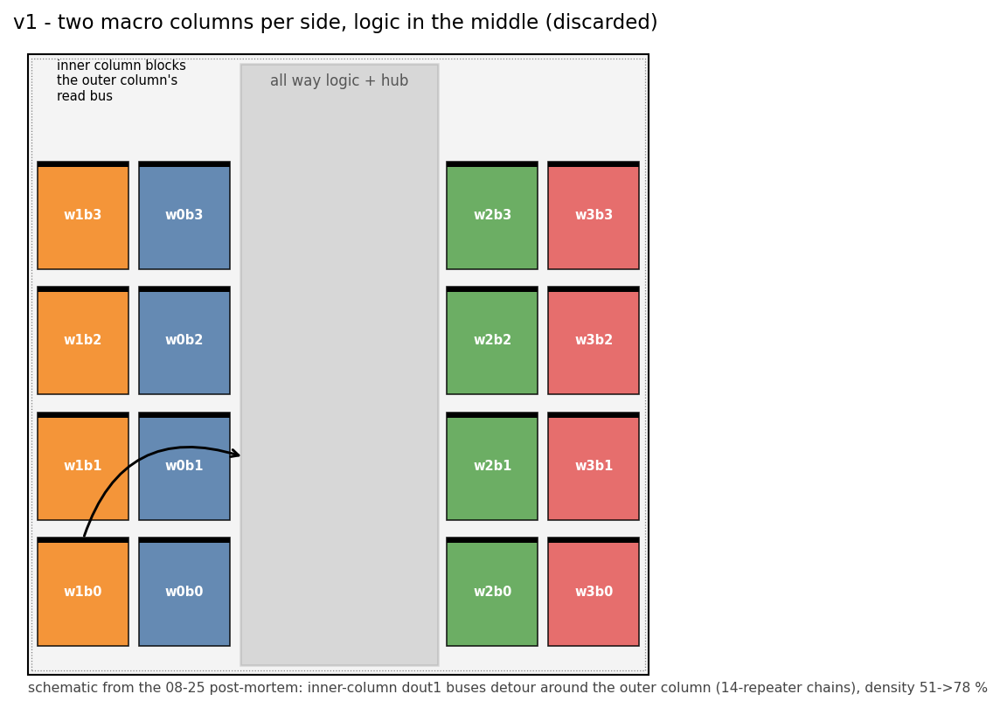

Macros in two columns on each side, way logic in the middle. The `dout1`
buses of the inner columns had to detour around the outer ones: 14-repeater
chains, density 51 → 78 % after opt, preCTS WNS -2.3 ns on the 4.0 ns
target. Also the run that found `route_special -block_pin` hanging and the
`li1` routing-layer trap. Killed at route; the single-file `asic/pnr/` flow it
ran in was deleted 08-26. Post-mortem in `asic/Innovus.md`.

## v2 — central macro block, logic on the perimeter (run 1, in flight)

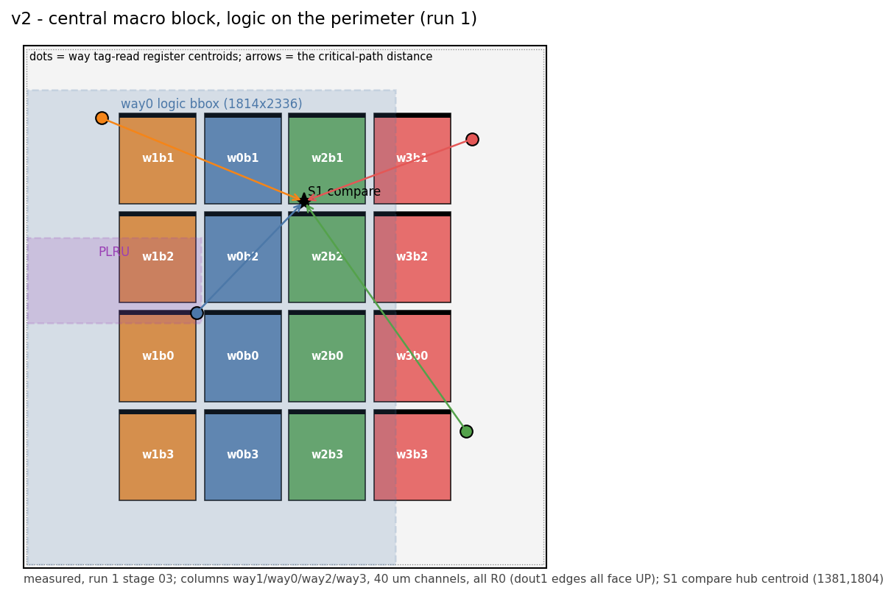

As placed by the tool: `innovus/reports/place/layout_03_place.png` (stage 03),
`innovus/reports/prects_opt/layout_04_prects_opt.png` (04), `innovus/reports/cts/layout_05_cts.png` (05).

`scripts/01_floorplan.tcl` as checked in: 4 columns × 4 rows in the centre,
columns ordered way1 / way0 / way2 / way3 left to right, 40 µm channels
(`ASIC_MACRO_COLS=4`, `ASIC_MACRO_GAP_X/Y=40`), columns alternating R0 / MY
(mirrored; the `dout1` top edge faces up on all 16), standard cells
wherever the placer put them — which was the perimeter, in quadrants by way.

Measured (staged flow, `innovus/reports/`):

| stage | setup WNS | TNS | hold | notes |
|---|---|---|---|---|
| 03 place (raw) | -94.7 (unbuffered) | — | — | density 44 %, overflow 2.9 H / 4.8 V, hotspot = left strip |
| 04 preCTS opt | -6.973 | -93.5 µs | — | density 72.8 %, overflow 10.6 / 14.5; 4h19m |
| 05 CTS | -5.143 | -32.6 µs | +0.046 | 2748 inverters, skew 0.485 ns; 4h44m |
| 06 postCTS opt | **-4.676** | -26.3 µs | **+0.001, 0 viol** | max_cap 3235, max_tran 307; 3h45m |
| 07 route | running | | | |

Reference: the discarded v2 attempt in the old single-file flow, same
floorplan but integrated `place_opt_design`, reached preCTS -3.8 ns. The
staged place-then-opt split costs ~3 ns on its own (see "Flow changes").

What v2 taught: the compare hub at (1381, 1804) is far from every way; the
way logic wraps around the block rather than sitting beside its macros; the
left strip is over-full because two ways plus the PLRU share it. The macro
grid itself is fine — the problem is what surrounds it.

## The iteration gallery (real Innovus captures, `innovus/scripts/snap_floorplan.sh`)

| iteration | floorplan | capture |
|---|---|---|
| 1 | v1 two-columns-per-side | no capture — discarded before the snapshot habit existed (08-26) |
| 2 | v2 central block + perimeter logic | 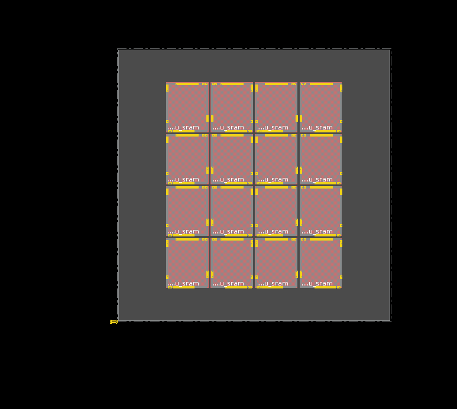 |
| 3 | v3-A quadrant tiles | 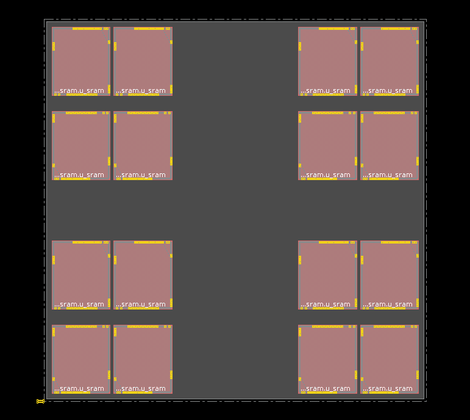 placed: 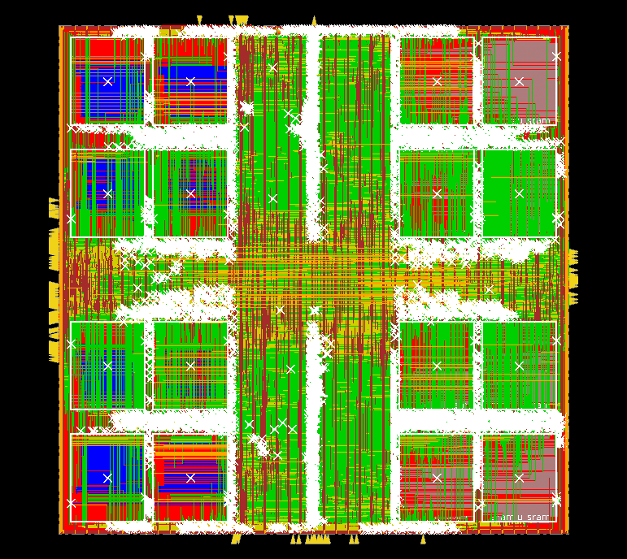 |
| 4 | v3-B true ring | 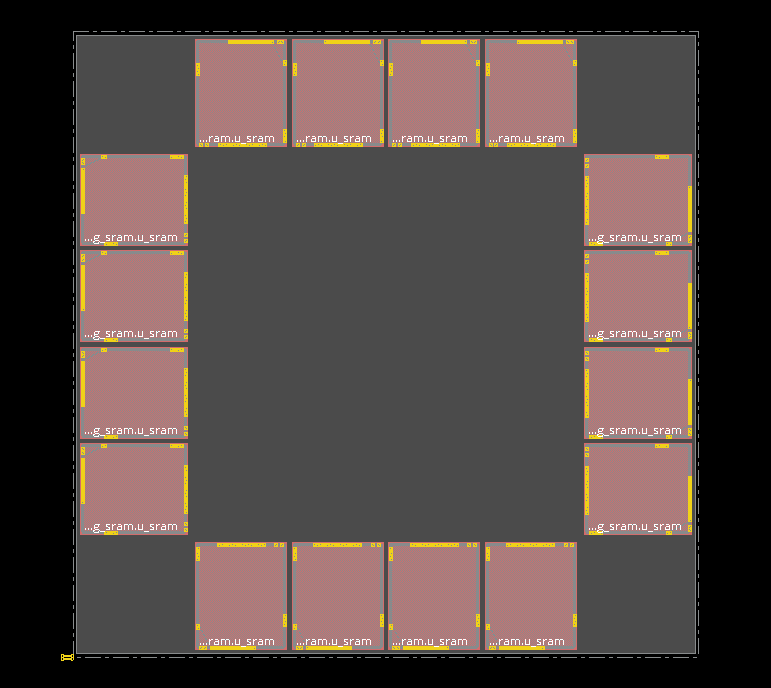 placed: 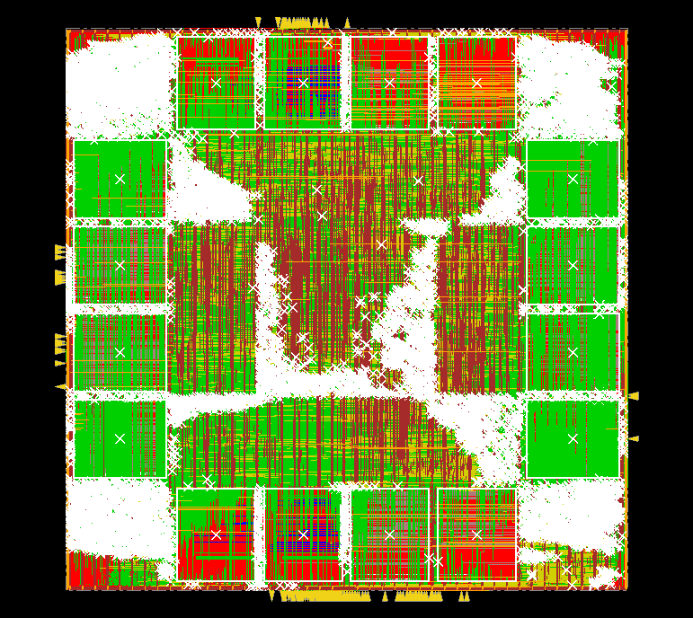 |
| 5 | ring, hub 940 um + density cap 0.62 |  placed: 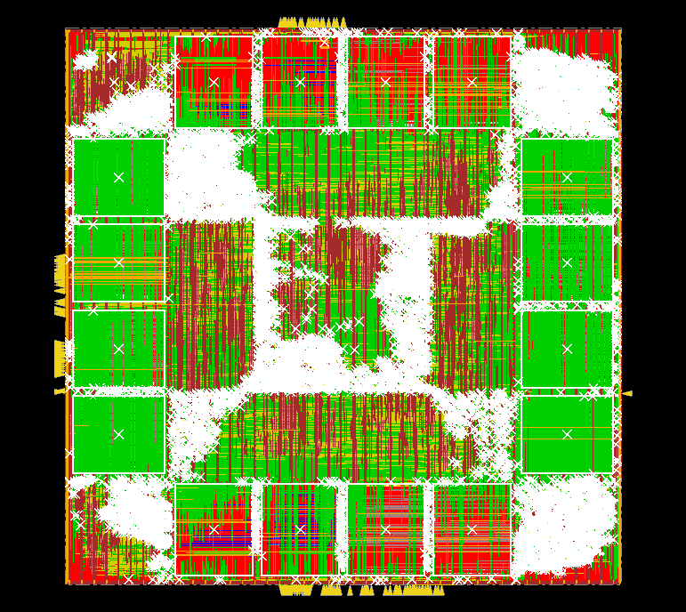 |
| 6 | quadrants + decongestion (regions -120 um, hub 1040, cap 0.62) | killed in stage 03 (2026-08-31) - no Innovus capture |
| 7 | ring + 40% hub place blockage (`fp_iter7.tcl`) - **route DRC 2,859, the breakthrough** | placed: 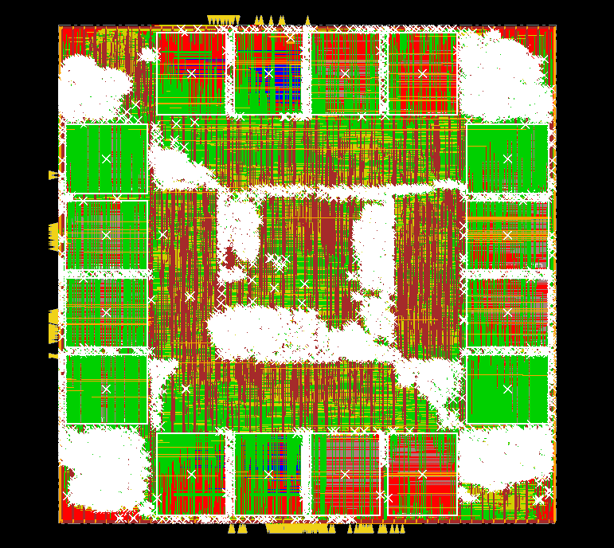 routed (with DRC markers): 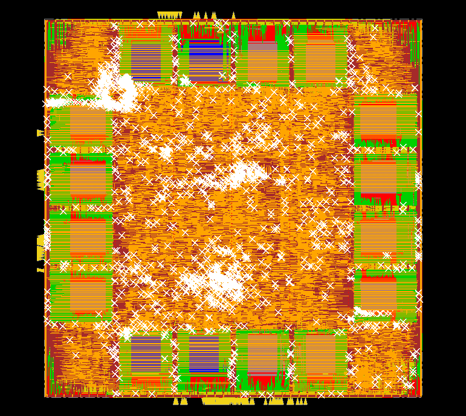 schematic: `fp_iter7.png` |
| 8 | same floorplan, E36(b) netlist | placed: 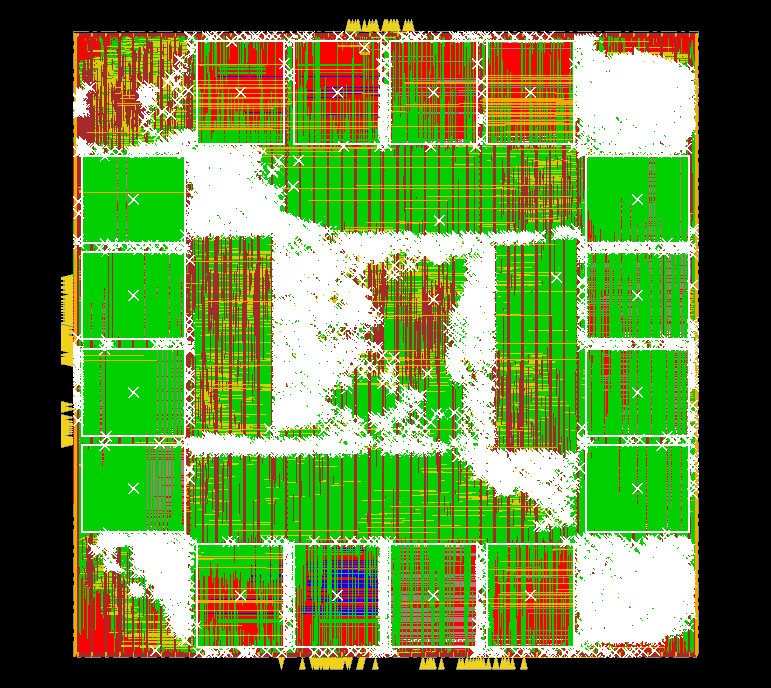 (route running 2026-08-31) |

**Dimensioned layout captures.** `floorplans/annotate_layout.py <in.gif>
<out.png> [die_um] --title ... --note ...` wraps any Innovus capture in a
micron coordinate frame - ruled axes, 500 µm scale bar, die/core outlines and
an area caption - so a reader can size anything in the picture. Produced so
far: `iter5_placed_dim.png`, `iter7_placed_dim.png`, `iter7_routed_dim.png`,
`iter8_placed_dim.png`, `iter11_routed_dim.png`. (KLayout is not installed on
this server; layout pictures come from Innovus via `snap_floorplan.sh` +
Xvfb, and Magic is the only GDS reader available.)

Every iteration also has a generated schematic (`floorplans/draw_floorplans.py`):
`fp_v1.png`, `fp_v2.png`, `fp_v3a.png` (iter 3), `fp_v3b.png` (iter 4),
`fp_iter5.png` (with the route-DRC bin overlay), `fp_iter6.png`.

v3-A/B captures are the `01_floorplan.enc` checkpoints of runs
`20260830_160055_v3{a,b}_e35abcde_ss1v76_d1p5`; macro orientations verified
from the database (v3-A: lower rows R0 / upper rows R180, every dout1 edge on
its tile channel; v3-B: R0/R180/R270/R90 per side, all inward).

## Iteration 4 route result and iteration 5 (2026-08-30 evening)

Iteration 4 (winner) cleared CTS+opt beautifully — **setup -1.252 / TNS -284 /
916 paths, hold CLEAN (+0.005, 0 violating)** — then hit the stage-05 DRC gate:
route completed in 21 min but with ~50k DRCs (104,845 markers at the gate).
Diagnosis from `reports/route/drc.rpt`: ~35k metal shorts + 15k spacing on
met1-met3, spatially concentrated in the hub bins (1.0-2.0 mm square), ~90%
among opt/CTS-inserted `FE_*`/`CTS_*` nets — **local hub over-density**, not
global shortage (post-route overflow only 7.3% H). The soft hub guide let
placement + CTS + opt stack ~13k spilled cells into an 840 um square.

**Iteration 5** = same ring, same die, two changes at that one variable:
`floorplans/fp_iter5.tcl` (wedge depth 430 -> 380, hub 840 -> 940 um, +25%
hub area) and `ASIC_PLACE_MAX_DENSITY=0.62` (new stage-03 hook capping local
placement density). Run `20260830_205109_iter5_ringhub_*`.

**Iteration 3's route (21:20): gate FAILED at 640,478 markers** (drc.rpt capped
at 100k: 78k shorts + 22k spacing, met1-met3, clustered in the center-south
cross where its quadrant channels converge; 91k lines involve `FE_*` nets).
Same disease as iteration 4, 6x the dose — its postCTS parity (-1.326, hold
clean) was real, but 79% density is unroutable, as predicted. The quadrant
geometry is now measured dead on BOTH axes that matter (route + hotspot);
the smaller die was never collectable.

**The "just run post-route opt anyway" experiment (user-requested, 23:27):**
optDesign -postRoute + -hold on iteration 4's gated route took the DRC count
**50,524 -> 136,482 (x2.7)**, shorts alone 105k — replicating v2's dose-
response (331k -> 1.8M was x5.5) at a smaller dose. Reported timing moved to
-9.6 ns setup, but timing over shorted extraction is fiction in both
directions. Conclusion, now measured twice: post-route optimisation on a
DRC-heavy route makes it strictly worse; the gate threshold is justified.
(reports/postroute_exp/ in the iter4 run dir.)

The gate itself fired (twice now) and did its job: routed DB saved
(`05_route.enc`), no wasted post-route opt, driver stopped before export.

**2026-08-31 verdicts — the DRC story now lives in `DRC.md`.** Iteration 5
postCTS -0.949 (campaign best) but routed into ~133k DRCs — same hub bins as
iteration 4 at ~2x the intensity, so hub size and placement density are both
measured dead as levers. Iteration 6 was killed mid-place with a worsening
congestion forecast. A router-only repair experiment plateaued at ~24k after
28 iterations. Autopsies, the hypothesis scoreboard and the Generation-7 plan:
`DRC.md`.

## v3 — the plan: one way = one locality

Principle: a way's four macros, its flop arrays and its read/compare logic
form a unit; the shared logic (final way select in S1, `RESPONSE_UNIT`,
`MSHR_FILE`, RS, arbiter, input regs) is a small hub equidistant from the
four units. Cross-die wires then carry one compared result per way, not four
raw reads.

Two candidate geometries. Both are a floorplan file (macro `placeInstance`
list + `createFence` per way + hub region) loaded by stage 01; the rest of
the flow is identical.

### v3-A — quadrant tiles

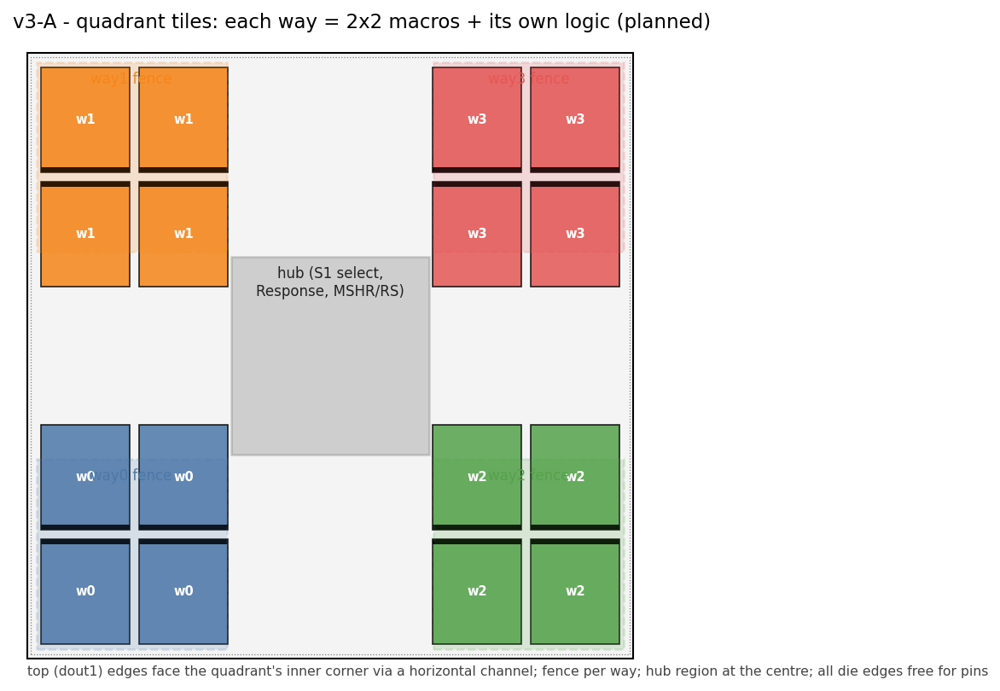

Each way's 4 macros in a 2 × 2 block in one quadrant, rotated so the top
(`dout1`) edges face the quadrant's inner corner; the way's fence wraps the
macros on the inside; the hub is a region at the die centre. Pins stay free
on all four die edges.

Risk: the 2 × 2 block puts one macro behind another for one of the two
inner-facing directions unless the rotation pairs are chosen carefully
(e.g. lower pair R0 facing up, upper pair R180 facing down, both toward a
horizontal channel that leads to the corner). Draw it before scripting it.

### v3-B — true ring, one way per side

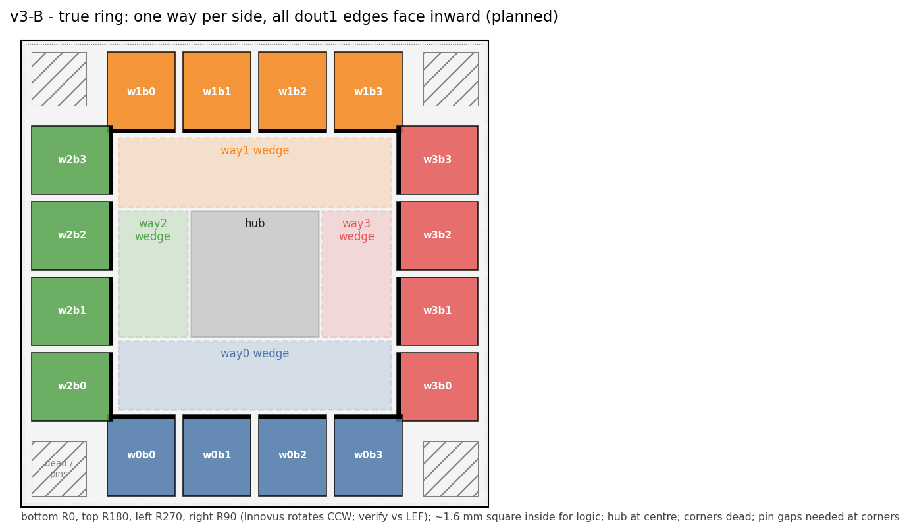

Four macros in a row along each die edge, one way per edge, each side's
macros rotated so the top edge faces inward: bottom side R0, top side R180,
left side R270, right side R90 (Innovus rotates counter-clockwise, so R90
sends the top edge to the left; verify against the LEF pin sides when placing). Each way's logic in a wedge between its macros and the centre; the
hub at the centre.

Fit: 4 × 376 = 1506 µm of macro along a 2542 µm core edge, macro depth
446 + halo, leaving a ~1.6 mm square inside — ~2.6 mm² for ~1.5 mm² of cells
plus buffering (≈ 55–60 % before opt). Tighter than v3-A.

Pros: perfect symmetry (every way sees the same distance to the hub), no bus
ever routes *around* a macro, one rotation per side. Cons: (1) the four data
buses converge on the centre — the congestion hotspot moves from the left
strip to the hub, so the hub region must be sized generously (≤ 60 %
density); (2) the die boundary is macro on four sides: block-level ports
need pin gaps at the corners, and the core PDN ring/stripes must reach
macros sitting on the boundary (halo + `vdd`/`gnd` macro pins, the stage-02
trap); (3) the four corners are dead area.

### Running both at once

`ASIC_PNR_RUN_STAMP=<name>` puts a run's checkpoints/reports/outputs/logs
under `innovus/runs/<name>/` (run 1 uses the bare `innovus/` root). Two
stamps = two tmux sessions = both candidates overnight; 128 cores / 503 GB
vs ~5 GB per session. Also add `setMultiCpuUsage -localCpu 16` to the run-2
preamble: the numbered flow never sets it, so run 1's 4-5 h stages ran on
one core.

### How the choice is made

Not by the tool — by the same early flow run on both and three reports read
side by side:

1. Build each as a floorplan file. Stage 01 loads it; nothing else differs.
2. Run init → floorplan → power → `place_opt_design` (integrated, not
   place-then-opt) → `timeDesign -preCTS` → checkpoint. ~5 h each;
   sequential overnight rather than two 5 GB sessions at once.
3. Compare: preCTS WNS/TNS (headline), `reportCongestion -hotspot`
   (what route will punish), `scripts/dbg_geography.tcl` (way-to-hub
   distances and whether the fences did what was drawn — the *why*).
4. Better WNS at acceptable congestion continues to CTS. Within ~0.3 ns,
   congestion decides.

Expected: v3-B wins on symmetry, v3-A on congestion and pin access; the
experiment exists because the net is not obvious.

### Flow changes that go with v3 (run 2)

- `place_opt_design` instead of `placeDesign` + `optDesign -preCTS` — the
  measured -3.8 vs -6.97 gap on the same v2 floorplan.
- CTS + postCTS opt (setup, then hold) in one script; route → save →
  `verify_drc` gate → postRoute opt in one script. Checkpoints kept at each
  boundary. New files (`r2_*.tcl`), the numbered 00–09 stay as the documented
  shakedown.
- Corner: run 2 signs off at ss_n40C_1v76 cells + vendor macro × 1.5
  (`asic/MACROS.md`, "Run 2 sign-off corner"); Genus run
  `20260828_151051_e35abcde_ss1v76_d1p5_tb16_sram` is the netlist source.

## Status

| item | state |
|---|---|
| v1 | discarded 08-25/26; post-mortem in `asic/Innovus.md` |
| v2 (run 1) | stage 07 route running in tmux `innovus_s04`; 06 checkpoint -4.676 / hold clean |
| v3-A tile floorplan file | **built 2026-08-30**: `floorplans/fp_v3a.tcl` (same die as v2) |
| v3-B ring floorplan file | **built 2026-08-30**: `floorplans/fp_v3b.tcl` (die grown to 2700 um - 1.6 mm inner square was too tight; prints dout1 pin coords after placement to verify the R90/R270 rotations) |
| run-2 scripts | folded into the numbered flow instead of `r2_*`: `ASIC_FLOORPLAN` (stage 01 sources a floorplan file), stages combined AND renumbered 2026-08-30: 03 = `place_opt_design` (old 03+04), 04 = CTS+postCTS opt (old 05+06), 05 = route + gate + postRoute opt (old 07+08), 06 = export (old 09); old split scripts in `innovus/scripts/retired/`, `ASIC_CPUS` (innovus_config); launcher `run_v3.sh a|b` runs 00-03 at corner 2 under a stamped run dir |
| run-2 netlist (corner 2) | done: `20260828_151051_e35abcde_ss1v76_d1p5` (WNS -59.3 ps at 3.5 ns) |
| iterations 5/6 (2026-08-31) | both dead at/before the route gate; ledger, autopsies, hypotheses and the Generation-7 plan in `DRC.md` |
| decision | **DECIDED 2026-08-30 ~18:50: iteration 4 (ring) wins.** preCTS -2.408 vs -2.903 WNS, TNS -825 vs -1403 ns, viol 3183 vs 7210, hotspot 4462 vs 12297, overflow 12.9/6.1 vs 19.9/5.9 %, density 60.8 vs 78.9 % (both at corner 2, 4.0 ns; the 0.3 ns band did not apply - iter 4 won both axes). Iteration 3's way logic smeared again (way2/3 spans ~2.2 mm - the quadrant channels feed awkwardly); iter 4 pays +10 % die. Caveat: comparisons to v2's -6.97 are CROSS-CORNER (v2 = ss_100C_1v60 x2.0, iters 3/4 = ss_n40C_1v76 x1.5) - corner accounts for roughly half the improvement, floorplan ~2-3 ns. Winner continuing 04-06 on stamp 20260830_160055_v3b. |

Sign-off deadline 2026-09-14. Run 1 completes the shakedown regardless of
its timing; run 2 is the number that gets quoted.
